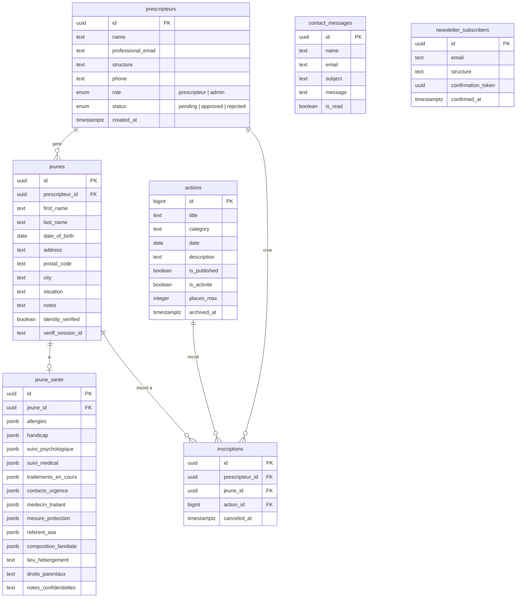
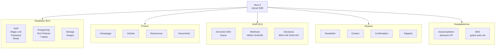
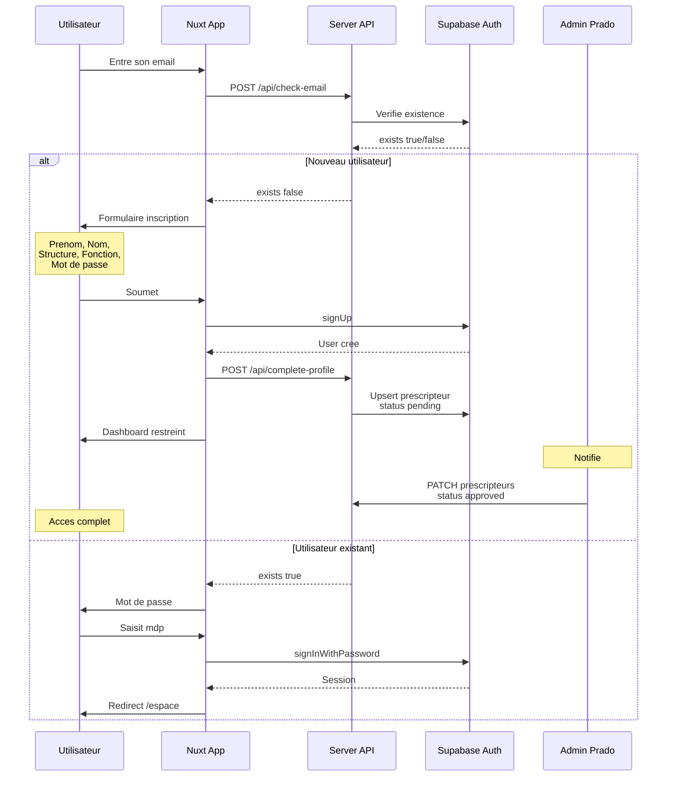
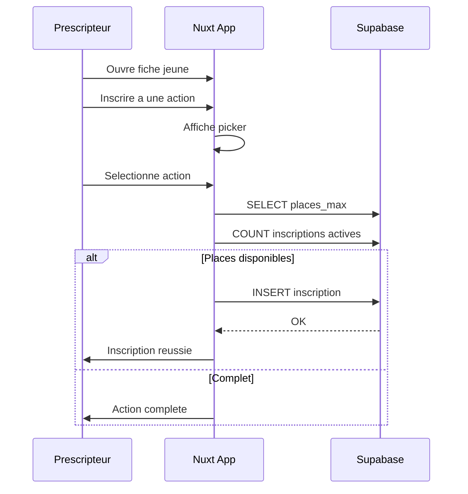
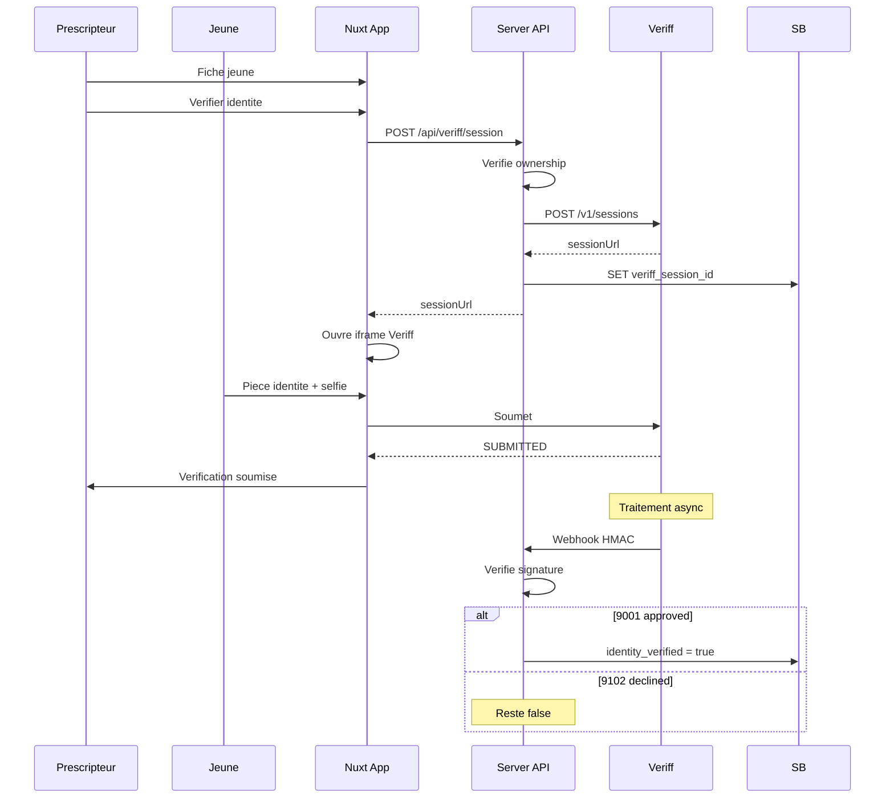

# Architecture Complete — Prado Itineraires

## 1. Vue d'ensemble

```mermaid
graph TB
    V[fa:fa-user Visiteur]
    P[fa:fa-user-tie Prescripteur]
    A[fa:fa-user-shield Admin]

    V --> VITRINE
    P --> ESPACE
    A --> ADMIN

    subgraph VITRINE["Site Vitrine"]
        direction TB
        HOME[Homepage]
        ACTIONS_PUB[Catalogue Actions]
        ACTUS[Actualites]
        RESS_PUB[Ressources]
        CONTACT[Contact]
        DOCS[Documents]
        LEGAL[Mentions legales]
        PROGRAMMES["Programmes<br/>Foodtruck / Fresque / EduColab"]
    end

    subgraph ESPACE["Espace Prescripteur"]
        direction TB
        DASH["Dashboard<br/>Stats + Actions contextuelles"]
        JEUNES["Gestion Jeunes<br/>CRUD + Export CSV"]
        JEUNE_DET["Fiche Jeune<br/>Identite + Sante + Famille"]
        ACTIONS_ESP["Catalogue Actions<br/>Filtres + Inscriptions"]
        INSCRIPTIONS[Mes Inscriptions]
        RESS_ESP[Ressources]
        PARAMS["Parametres<br/>Profil + Securite + Compte"]
    end

    subgraph ADMIN["Panel Admin"]
        direction TB
        ADMIN_DASH["Dashboard<br/>Stats + Activite"]
        ADMIN_PRESC["Prescripteurs<br/>Approuver / Rejeter"]
        ADMIN_JEUNES[Vue Jeunes]
        ADMIN_ACTIONS["Actions<br/>Creer + Archiver"]
        ADMIN_INSCR[Inscriptions]
        ADMIN_CONTACTS[Messages Contact]
        ADMIN_NEWS[Newsletter]
    end

    JEUNES --> JEUNE_DET
    ACTIONS_ESP --> JEUNE_DET
```

## 2. API Routes

```mermaid
graph TB
    subgraph PUBLIC["API Publiques"]
        direction TB
        A1["GET /api/actions"]
        A2["GET /api/actions/map"]
        A3["GET /api/actions/:id"]
        A4["POST /api/contact"]
        A5["POST /api/newsletter"]
        A6["GET /api/newsletter/confirm"]
        A7["POST /api/check-email"]
    end

    subgraph AUTH["API Authentifiees"]
        direction TB
        B1["POST /api/complete-profile"]
        B2["POST /api/update-profile"]
        B3["POST /api/delete-account"]
        B4["GET /api/export-data"]
        B5["GET /api/jeunes/:id/sante"]
        B6["PUT /api/jeunes/:id/sante"]
        B7["PUT /api/jeunes/:id"]
    end

    subgraph VERIFF["API Veriff"]
        direction TB
        C1["POST /api/veriff/session"]
        C2["POST /api/webhooks/veriff"]
    end

    subgraph ADMIN_API["API Admin"]
        direction TB
        D1["GET /api/admin/stats"]
        D2["GET /api/admin/activity"]
        D3["GET/POST/PATCH<br/>/api/admin/actions"]
        D4["GET/PATCH<br/>/api/admin/prescripteurs"]
        D5["GET /api/admin/jeunes"]
        D6["GET/PATCH<br/>/api/admin/contacts"]
        D7["GET /api/admin/newsletter"]
        D8["GET /api/admin/inscriptions"]
    end

    subgraph CRON["Cron Jobs"]
        direction TB
        E1["GET /api/cron/archive-actions"]
        E2["GET /api/cron/send-reminders"]
    end

    PUBLIC --- |"Aucune auth"| SB[(Supabase)]
    AUTH --- |"JWT utilisateur"| SB
    VERIFF --- |"HMAC-SHA256"| VF[Veriff]
    ADMIN_API --- |"Service Role Key"| SB
    CRON --- |"X-Cron-Secret"| SB
```

## 3. Base de donnees

## 4. Droits d'acces

```mermaid
graph TB
    subgraph VISIT["Visiteur"]
        direction TB
        VA["Site vitrine"]
        VB["Catalogue public"]
        VC["Contact"]
        VD["Newsletter"]
    end

    subgraph PENDING["Prescripteur PENDING"]
        direction TB
        PA["Dashboard lecture seule"]
        PB["Parcourir actions"]
        PC["Parcourir ressources"]
        PD["Parametres profil"]
        PE["Ajouter jeunes BLOQUE"]
        PF["Inscrire jeunes BLOQUE"]
    end

    subgraph APPROVED["Prescripteur APPROVED"]
        direction TB
        QA["Dashboard complet"]
        QB["CRUD ses propres jeunes"]
        QC["Fiche sante ses jeunes"]
        QD["Inscrire a des actions"]
        QE["Verif identite Veriff"]
        QF["Export CSV"]
        QG["Annuler inscriptions"]
    end

    subgraph ADM["Admin"]
        direction TB
        RA["Stats globales"]
        RB["Approuver prescripteurs"]
        RC["Voir tous les jeunes"]
        RD["Creer/archiver actions"]
        RE["Gerer capacite"]
        RF["Messages contact"]
        RG["Newsletter"]
        RH["Exports"]
    end

    subgraph RLS["Row Level Security"]
        direction TB
        R1["prescripteurs<br/>SELECT own row"]
        R2["jeunes<br/>WHERE prescripteur_id = uid"]
        R3["jeune_sante<br/>WHERE jeune.prescripteur_id = uid"]
        R4["inscriptions<br/>WHERE prescripteur_id = uid"]
    end

    subgraph MW["Middleware"]
        direction TB
        M1["auth.ts<br/>Redirige si non connecte"]
        M2["admin.ts<br/>Redirige si pas admin"]
        M3["requireAdmin<br/>Verifie role serveur"]
    end

    VISIT -.->|"Aucun auth"| RLS
    PENDING -->|"JWT"| RLS
    APPROVED -->|"JWT"| RLS
    ADM -->|"Service Role"| RLS
```

## 5. Services externes

## 6. Flux d'authentification

## 7. Flux inscription jeune

## 8. Flux verification identite

