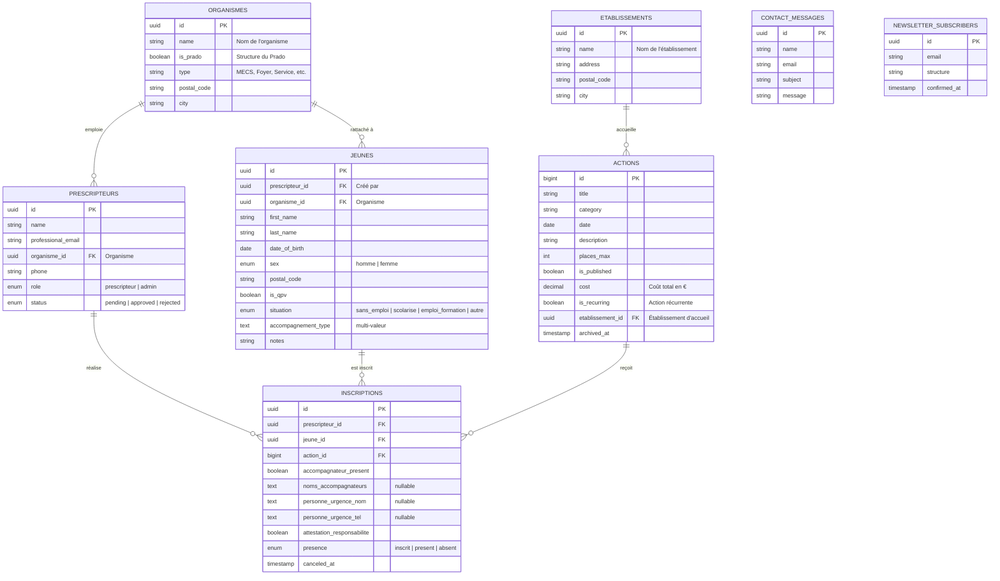

# Cahier des charges — Prado Itinéraires

> **Client** : Association Le Prado — Direction Itinéraires
> **Prestataire** : Devops
> **Version** : 1.0 — 27 mars 2026
> **Statut** : Soumis pour validation

---

## Sommaire

1. [Introduction et contexte](#1-introduction-et-contexte)
2. [Les trois espaces de la plateforme](#2-les-trois-espaces-de-la-plateforme)
3. [Parcours utilisateurs](#3-parcours-utilisateurs)
4. [Fonctionnalités détaillées](#4-fonctionnalités-détaillées)
   - 4.1 Site vitrine (public)
   - 4.2 Espace prescripteur
   - 4.3 Panel d'administration
5. [UX/UI et Design](#5-uxui-et-design)
6. [Architecture technique](#6-architecture-technique)
7. [Base de données et modèle de données](#7-base-de-données-et-modèle-de-données)
8. [Intégrations et services tiers](#8-intégrations-et-services-tiers)
9. [Emails et newsletter](#9-emails-et-newsletter)
10. [Sécurité et conformité RGPD](#10-sécurité-et-conformité-rgpd) *(Règlement UE 2016/679)*
11. [Migration des données existantes](#11-migration-des-données-existantes)
12. [Déploiement et infrastructure](#12-déploiement-et-infrastructure)
13. [Coûts récurrents](#13-coûts-récurrents)
14. [Roadmap](#14-roadmap)
15. [Foire aux questions](#15-foire-aux-questions)
16. [Glossaire](#16-glossaire)

---

## 1. Introduction et contexte

### 1.1 Présentation du projet

**Prado Itinéraires** est une plateforme numérique socio-éducative qui connecte les professionnels de l'accompagnement (prescripteurs) avec les jeunes bénéficiaires de l'association Le Prado, dans le département du Rhône.

La plateforme remplace et modernise les outils existants en proposant :
- Un **site vitrine** présentant l'association, ses programmes et ses actions au grand public
- Un **espace prescripteur** permettant aux professionnels de gérer les jeunes qu'ils accompagnent et de les inscrire à des actions socio-éducatives
- Un **panel d'administration** pour l'équipe Prado, centralisant la gestion des comptes, des actions et du suivi

### 1.2 Objectifs

| Objectif | Description |
|----------|-------------|
| **Visibilité** | Présenter l'association et ses programmes sur un site moderne et engageant |
| **Efficacité** | Permettre aux prescripteurs de gérer leurs jeunes et inscriptions en ligne, sans formulaire papier |
| **Conformité** | Respecter les obligations légales ([RGPD](https://www.cnil.fr/fr/reglement-europeen-protection-donnees)) |
| **Autonomie** | Permettre à l'équipe Prado de modifier le contenu éditorial sans intervention technique |
| **Sécurité** | Garantir l'isolation des données entre organismes et le contrôle d'accès par rôle |

### 1.3 Utilisateurs cibles

| Rôle | Qui ? | Ce qu'il fait |
|------|-------|---------------|
| **Visiteur** | Grand public, partenaires, financeurs | Consulte le site vitrine, s'abonne à la newsletter, envoie un message |
| **Prescripteur** | Éducateur, référent ASE/PJJ, conseiller en insertion | Crée un compte, gère ses jeunes, les inscrit à des actions |
| **Admin** | Équipe Prado (direction Itinéraires) | Valide les comptes, gère les actions, consulte les statistiques |

---

## 2. Les trois espaces de la plateforme

La plateforme se compose de trois espaces distincts, chacun adapté à son public :

```mermaid
graph LR
    subgraph PUBLIC["Site vitrine — tout le monde"]
        direction TB
        P1["Page d'accueil"]
        P2["Catalogue d'actions"]
        P3["Ressources"]
        P5["Contact"]
        P6["Newsletter"]
        P7["Pages programmes"]
    end

    subgraph ESPACE["Espace prescripteur — professionnels validés"]
        direction TB
        E1["Tableau de bord"]
        E2["Mes jeunes (fiches)"]
        E3["Actions disponibles"]
        E4["Mes inscriptions"]
        E5["Ressources"]
        E6["Paramètres du compte"]
        E7["Guide de démarrage"]
    end

    subgraph ADMIN["Administration — équipe Prado uniquement"]
        direction TB
        A1["Tableau de bord & stats"]
        A2["Validation prescripteurs"]
        A3["Gestion des actions"]
        A4["Vue globale des jeunes"]
        A5["Messages de contact"]
        A6["Newsletter & abonnés"]
    end

    V["Visiteur"] --> PUBLIC
    PR["Prescripteur"] --> ESPACE
    AD["Équipe Prado"] --> ADMIN

    style PUBLIC fill:#1a3a2a,stroke:#93C1AF,stroke-width:2px
    style ESPACE fill:#2a2a1a,stroke:#FFD228,stroke-width:2px
    style ADMIN fill:#4a1942,stroke:#CF006C,stroke-width:2px
```

### Matrice des droits d'accès

| Fonctionnalité | Visiteur | Prescripteur en attente | Prescripteur validé | Admin |
|---|:---:|:---:|:---:|:---:|
| Site vitrine | ✅ | ✅ | ✅ | ✅ |
| Créer un compte | ✅ | — | — | — |
| Tableau de bord | — | Lecture seule | ✅ Complet | ✅ Admin |
| Ajouter un jeune | — | ❌ Bloqué | ✅ | — |
| Inscrire à une action | — | ❌ Bloqué | ✅ | — |
| Fiche jeune | — | — | Jeunes de son organisme | — |
| Valider un prescripteur | — | — | — | ✅ |
| Gérer les actions | — | — | — | ✅ |
| Voir tous les jeunes | — | — | — | ✅ |
| Exporter des données | — | — | Ses données | ✅ Tout |

> **Règle fondamentale** : les jeunes sont rattachés à l'**organisme** (structure) du prescripteur qui les a ajoutés. Tous les prescripteurs d'un même organisme **partagent l'accès** aux jeunes de cet organisme. En revanche, un prescripteur ne peut **jamais** voir les jeunes d'un autre organisme. Cette isolation est gérée au niveau de la base de données elle-même, pas uniquement dans l'interface.

---

## 3. Parcours utilisateurs

### 3.1 Parcours visiteur

```mermaid
graph TB
    A["Visiteur arrive sur le site"] --> B["Consulte la page d'accueil"]
    A --> C["Parcourt le catalogue d'actions"]
    A --> D["Consulte les ressources"]
    A --> E["Envoie un message via le formulaire"]
    A --> F["S'abonne à la newsletter"]
    A --> G["Décide de créer un compte"]
    G -->|"Parcours prescripteur"| H["Voir section 3.2"]

    style A fill:#2a2a1a,stroke:#FFD228,stroke-width:2px
    style G fill:#1a3a2a,stroke:#93C1AF,stroke-width:2px
    style H fill:#4a1942,stroke:#CF006C,stroke-width:2px
```

### 3.2 Parcours prescripteur — Inscription et validation

```mermaid
graph TB
    A["Le prescripteur arrive<br/>sur la page de connexion"] --> B["Il entre son email"]
    B --> C{"Email déjà connu ?"}

    C -->|"Non"| D["Formulaire d'inscription<br/>Prénom, Nom, Structure,<br/>Fonction, Mot de passe"]
    D --> E["Compte créé<br/>Statut : EN ATTENTE"]
    E --> F["L'équipe Prado<br/>reçoit la demande"]
    F --> G{"Validation"}
    G -->|"Approuvé"| H["Accès complet"]
    G -->|"Refusé"| I["Accès bloqué"]

    C -->|"Oui"| J["Saisie du mot de passe"]
    J --> K["Connexion réussie"]

    style H fill:#1a3a2a,stroke:#93C1AF,stroke-width:2px
    style I fill:#4a1942,stroke:#CF006C,stroke-width:2px
    style E fill:#2a2a1a,stroke:#FB6223,stroke-width:2px
```

### 3.3 Guide de démarrage (onboarding)

À la première connexion, un **widget de démarrage** flottant guide le prescripteur étape par étape :

| Étape | Description | Ce qui se passe |
|:---:|-------------|-----------------|
| 1 | Créer son compte | Déjà fait à l'inscription |
| 2 | Compléter son profil professionnel | Formulaire guidé |
| 3 | Parcourir le catalogue d'actions | Découverte des actions disponibles |
| 4 | Ajouter son premier jeune | Création d'une fiche jeune |
| 5 | Inscrire un jeune à une action | Première inscription |

Le widget montre la progression en temps réel et disparaît une fois toutes les étapes complétées.

### 3.4 Parcours de gestion d'un jeune

```mermaid
graph TB
    A["1. Ajouter un jeune<br/>Prénom, Nom, Date de naissance,<br/>Sexe, Code postal, QPV,<br/>Situation, Accompagnement"] --> B["2. Inscrire le jeune à une action<br/>Choix accompagnateur/autonomie<br/>Attestation de responsabilité<br/>Vérification des places disponibles"]

    style A fill:#2a2a1a,stroke:#FFD228,stroke-width:2px
    style B fill:#1a3a2a,stroke:#93C1AF,stroke-width:2px
```

---

## 4. Fonctionnalités détaillées

### 4.1 Site vitrine (public)

#### Page d'accueil

La page d'accueil est conçue pour présenter l'association de manière engageante et inciter à l'action. Elle est composée de sections modulaires, modifiables depuis le CMS Prismic :

| Section | Contenu | Modifiable par Prado |
|---------|---------|:---:|
| **Hero** | Titre accrocheur, phrase d'accroche, bouton d'action | ✅ |
| **Programmes** | Présentation des programmes phares (Foodtruck, Fresque, EduColab, etc.) | ✅ |
| **Missions** | Les missions de l'association | ✅ |
| **Chiffres d'impact** | Statistiques clés (jeunes accompagnés, actions réalisées...) | ✅ |
| **Étapes** | Comment fonctionne le dispositif (en 3-4 étapes) | ✅ |
| **Témoignages** | Citations de prescripteurs ou partenaires | ✅ |
| **FAQ** | Questions fréquentes avec accordéons | ✅ |
| **Partenaires** | Logos des partenaires institutionnels | ✅ |
| **Newsletter** | Formulaire d'inscription | Automatique |
| **Actualités** | Slider/carrousel d'annonces et d'actualités (dernières nouvelles, événements à venir) | ✅ |
| **Appel à l'action final** | Lien vers la création de compte | ✅ |

<strong>💡 Pourquoi ce choix : contenu éditable via un CMS ?</strong>

L'équipe Prado doit pouvoir mettre à jour les textes, chiffres et témoignages de la page d'accueil sans intervention technique. Prismic offre une interface visuelle simple (comme un traitement de texte) qui permet de modifier le contenu en quelques clics. Cela évite :
- De dépendre du prestataire pour chaque modification de texte
- Des délais et coûts supplémentaires à chaque changement
- Le risque d'erreur en modifiant directement le code

#### Catalogue d'actions

Le catalogue est la vitrine publique des actions socio-éducatives proposées par Le Prado :

- **Affichage** : cartes visuelles avec image, titre, catégorie, date, places restantes
- **Filtrage** : par catégorie (atelier, formation, stage, etc.)
- **Pagination** : chargement progressif pour les longs catalogues
- **Détail** : page dédiée pour chaque action avec description complète, informations pratiques et bouton d'inscription (renvoie vers l'espace prescripteur)

#### Ressources et documents

Espace de consultation de documents utiles (guides, fiches pratiques, documents administratifs) :

- Classement par catégorie
- Téléchargement direct des fichiers
- Gestion des fichiers depuis Prismic

#### Pages programmes

Pages dédiées aux programmes phares de l'association :

| Page | Contenu |
|------|---------|
| Foodtruck | Présentation du programme foodtruck, menu du mois modifiable depuis Prismic |
| Fresque du climat | Ateliers de sensibilisation |
| EduColab | Programme éducatif collaboratif |

Exemple : le menu du mois du Foodtruck est modifiable directement depuis Prismic par l'équipe Prado :

#### Autres pages publiques

| Page | Description |
|------|-------------|
| **Contact** | Formulaire de contact (nom, email, sujet, message) — les messages sont envoyés à itineraires@le-prado.fr et consultables dans l'admin |
| **Newsletter** | Formulaire d'inscription avec double confirmation (le visiteur reçoit un email et doit cliquer pour confirmer) |
| **Mentions légales** | Mentions obligatoires |
| **Politique de confidentialité** | Détail de la politique [RGPD](https://www.cnil.fr/fr/reglement-europeen-protection-donnees) |

---

### 4.2 Espace prescripteur

L'espace prescripteur est accessible après connexion et validation du compte par l'équipe Prado.

#### Tableau de bord

Vue d'ensemble de l'activité du prescripteur :

| Élément | Description |
|---------|-------------|
| **Compteurs** | Nombre de jeunes, inscriptions actives, actions disponibles |
| **Actions contextuelles** | Raccourcis vers les tâches fréquentes (ajouter un jeune, inscrire, etc.) |
| **Dernières inscriptions** | Liste des inscriptions récentes |

#### Gestion des jeunes

Le cœur de l'espace prescripteur est la gestion des fiches jeunes. Chaque fiche se compose de plusieurs volets :

**Fiche jeune**
| Champ | Description | Particularité |
|-------|-------------|---------------|
| Prénom, Nom | Identité du jeune | Obligatoire |
| Date de naissance | Format JJ/MM/AAAA | Sélecteur de date adapté |
| Sexe | Homme / Femme | Obligatoire (nécessaire pour les statistiques) |
| Code postal | Code postal du lieu de résidence | Saisie manuelle |
| QPV | Le jeune réside en Quartier Prioritaire de la politique de la Ville | Checkbox oui/non, déclaratif |
| Situation | Sans emploi ni formation / Scolarisé en milieu ordinaire / Scolarisé en milieu médico-social / En emploi ou formation pro / Autre | Select catégorisé (nécessaire pour les statistiques) |
| Accompagnement au titre de | ASE / PJJ / Handicap / Décrochage scolaire / RSJ / CEJ / Autre | Choix multiples |
| Notes | Notes internes du prescripteur | Champ libre |

#### Inscription aux actions

Le prescripteur inscrit ses jeunes aux actions disponibles :

- Parcours du catalogue depuis le dashboard
- **Inscription groupée** : possibilité de sélectionner plusieurs jeunes pour les inscrire à la même action en une seule opération
- Vérification automatique des places disponibles
- Détection des conflits d'horaires
- Confirmation par email
- Possibilité d'annulation

**Avant validation de l'inscription**, le prescripteur doit :

1. **Choisir le mode de participation** (mutuellement exclusif) :
   - **Accompagnateur présent** → saisir le nom, prénom et téléphone de l'accompagnateur
   - **Le jeune participe en autonomie** → saisir le nom et téléphone d'une personne à prévenir en cas d'urgence

2. **Cocher l'attestation de responsabilité** (obligatoire, bloquante) :
   > *« J'atteste que le jeune que j'inscris reste sous la responsabilité de mon établissement pendant la durée de l'atelier. »*

#### Paramètres du compte

| Section | Fonctionnalités |
|---------|----------------|
| **Profil** | Modifier nom, structure, fonction, téléphone |
| **Compte** | Changer l'email, le mot de passe |
| **Sécurité** | Options de sécurité du compte |
| **Notifications** | Préférences de notification |
| **Suppression** | Supprimer le compte et toutes les données associées ([droit à l'effacement — Art. 17 RGPD](https://www.cnil.fr/fr/reglement-europeen-protection-donnees/chapitre3/article17)) |
| **Export** | Exporter ses données personnelles ([droit à la portabilité — Art. 20 RGPD](https://www.cnil.fr/fr/reglement-europeen-protection-donnees/chapitre3/article20)) |

---

### 4.3 Panel d'administration

Le panel d'administration est accessible uniquement aux membres de l'équipe Prado ayant le rôle « admin ».

#### Tableau de bord admin

Vue d'ensemble globale avec compteurs et activité récente :

| Compteur | Description |
|----------|-------------|
| Prescripteurs | Total + en attente de validation |
| Jeunes | Total enregistrés |
| Inscriptions | Total aux actions |
| Contacts | Messages non lus |
| Newsletter | Nombre d'abonnés |

Un journal d'activité affiche les dernières actions (nouvelle inscription, nouveau prescripteur, etc.) avec horodatage.

#### Gestion des prescripteurs

| Action | Description |
|--------|-------------|
| **Voir** | Liste de tous les prescripteurs avec leur statut, structure, date d'inscription |
| **Filtrer** | Par statut (en attente, validé, refusé), par structure |
| **Approuver** | Valider un nouveau prescripteur → il reçoit l'accès complet |
| **Refuser** | Rejeter une demande → le prescripteur voit un message d'erreur |

#### Gestion des actions

| Action | Description |
|--------|-------------|
| **Créer** | Nouvelle action avec titre, catégorie, date, description, image, nombre de places |
| **Modifier** | Mettre à jour les informations d'une action |
| **Publier/Dépublier** | Contrôler la visibilité dans le catalogue |
| **Archiver** | Retirer du catalogue une action passée (archivage automatique programmé chaque nuit) |
| **Gérer la capacité** | Suivre le remplissage (inscriptions vs. places max) |
| **Récurrence** | Créer des actions récurrentes (ex : un atelier chaque mardi) avec gestion individuelle de chaque occurrence |

#### Autres fonctionnalités admin

| Module | Description |
|--------|-------------|
| **Vue jeunes** | Voir tous les jeunes de tous les prescripteurs (lecture seule) |
| **Inscriptions** | Vue d'ensemble de toutes les inscriptions, avec filtres |
| **Contacts** | Messages reçus via le formulaire, marquer comme lu, exporter en CSV |
| **Newsletter** | Liste des abonnés, exporter en CSV |

#### Émargement des présences

L'administrateur peut pointer la présence des jeunes inscrits à une action :

| Fonctionnalité | Description |
|----------------|-------------|
| **Pointage** | Pour chaque action, liste des jeunes inscrits avec case présent/absent |
| **Statut** | Chaque inscription a un statut de présence : inscrit (par défaut), présent, absent |
| **Taux de participation** | Calculé automatiquement à partir du pointage (présents / inscrits) |
| **Export PDF** | Feuille de présence exportable en PDF pour les financeurs |

L'émargement alimente directement les statistiques (taux de participation, taux d'absentéisme).

#### Rapport d'action (PDF)

Pour chaque action passée, l'administrateur peut générer un **rapport PDF** synthétique récapitulant l'ensemble des informations de l'action :

| Contenu du rapport | Description |
|--------------------|-------------|
| **Informations de l'action** | Titre, catégorie/programme, date, lieu, description, coût |
| **Liste des participants** | Jeunes inscrits avec statut de présence (présent/absent), organisme d'origine |
| **Accompagnateurs** | Nom et coordonnées des accompagnateurs présents |
| **Indicateurs** | Nombre d'inscrits, nombre de présents, taux de participation |
| **Organismes concernés** | Liste des organismes ayant inscrit au moins un jeune |

Le rapport peut être :
- **Téléchargé** directement en PDF depuis le panel d'administration
- **Envoyé par email** à un ou plusieurs destinataires (financeur, direction Prado, établissement)

> Ce rapport est destiné à être transmis aux financeurs ou à la direction du Prado comme justificatif d'une action réalisée.

#### Module statistiques

Un onglet **« Statistiques »** dans le panel d'administration permet de visualiser les indicateurs clés, avec un **filtre par année** (toutes les métriques se recalculent en fonction de l'année sélectionnée).

**Profils & situations**
| Indicateur | Description |
|------------|-------------|
| Jeunes inscrits | Nombre de jeunes inscrits à au moins 1 action (+ évolution vs année précédente) |
| Âge médian | Âge médian des jeunes inscrits |
| Répartition par sexe | % femmes / % hommes |
| Répartition par situation | Graphique : sans emploi ni formation / scolarisé milieu ordinaire / scolarisé milieu médico-social / en emploi ou formation pro / autre |

**Provenances**
| Indicateur | Description |
|------------|-------------|
| Origine géographique | % de jeunes de la métropole de Lyon (basé sur le code postal) |
| Structures prescriptrices | Nombre total de structures, dont structures du Prado (+ % des inscrits) |
| Accompagnement au titre de | Graphique (camembert) : répartition par type d'accompagnement (ASE, PJJ, Handicap, etc.) |

**Les actions**
| Indicateur | Description |
|------------|-------------|
| Nombre d'actions | Total + répartition par catégorie/programme (graphique en anneau) |
| Taux de participation | % (calculé à partir de l'émargement : présents / inscrits) |
| Jeunes par action | Nombre moyen de jeunes par action |
| Fidélisation | % de jeunes participant à 1 action / 2 actions / 3 actions et + |

#### Module budget (confidentiel)

Le module budget est accessible uniquement aux administrateurs. Il permet de suivre les coûts des actions et leur répartition entre les établissements.

| Fonctionnalité | Description |
|----------------|-------------|
| **Coût par action** | Champ renseigné à la création/modification d'une action (coût total en €) |
| **Ventilation par organisme** | Chaque organisme ayant au moins un jeune inscrit à une action se voit imputer le coût total de l'action. Si 2 organismes participent à une action à 300 €, chacun comptabilise 300 € (le coût n'est pas divisé — l'action coûte le même prix qu'il y ait 1 ou 6 jeunes) |
| **Récapitulatif par organisme** | Total des coûts imputés par organisme, filtrable |
| **Filtre par année** | Récapitulatif année par année |
| **Total global** | Somme des coûts de toutes les actions réalisées par année |
| **Prix moyen** | Prix moyen d'une action, calculé sur l'ensemble des actions |

---

## 5. UX/UI et Design

### 5.1 Inspiration et direction artistique

Le design de Prado Itinéraires s'inspire du site [idealco.fr](https://idealco.fr/) pour sa mise en page structurée, son approche moderne et ses choix de navigation clairs, tout en développant une identité propre à l'association Le Prado.

### 5.2 Palette de couleurs

La palette suit la **nouvelle identité visuelle de la Fondation du Prado** (mars 2026). Chaque association affiliée utilise les couleurs de la fondation (orange et bleu marine) complétées par sa couleur propre. Pour **Prado Itinéraires**, la couleur associée est un vert-teal.

| Couleur | Code | Usage |
|---------|------|-------|
| **Orange Prado** | `#FB6223` | Couleur principale de la fondation : boutons, liens actifs, accents, appels à l'action |
| **Bleu marine Prado** | `#024266` | Couleur secondaire de la fondation : textes, en-têtes, barre latérale, éléments professionnels |
| **Vert-teal Itinéraires** | *(à confirmer — couleur spécifique Prado Itinéraires dans la charte)* | Couleur d'accentuation propre à Itinéraires : succès, validations, éléments distinctifs |

> La charte graphique de la Fondation du Prado (mars 2026) n'est pas encore définitive. Les codes couleurs ci-dessus pourront être ajustés à réception de la version finale.

### 5.3 Typographie

La typographie suit la charte de la Fondation du Prado :

| Propriété | Valeur |
|-----------|--------|
| **Police des titres** | Neulis Neue Bold |
| **Police du corps** | [Poppins](https://fonts.google.com/specimen/Poppins) ([Google Fonts](https://fonts.google.com/)) |
| **Graisses Poppins** | Regular (400), Medium (500), Semi-Bold (600) |

### 5.4 Thème clair / sombre

La plateforme propose un **thème clair par défaut** et un **thème sombre** basculable via un interrupteur. Le choix de l'utilisateur est mémorisé dans le navigateur.

| Thème | Fond principal | Surface | Texte |
|-------|---------------|---------|-------|
| **Clair** (défaut) | `#f5f5f7` (gris clair) | `#ffffff` | Bleu marine `#024266` |
| **Sombre** | `#1a1a2e` (marine profond) | `#232340` | Blanc |

<strong>💡 Pourquoi proposer un thème sombre ?</strong>

Le thème clair est le défaut, en cohérence avec la charte graphique du Prado. Le thème sombre est proposé en option pour les prescripteurs qui préfèrent travailler sur fond foncé, notamment en fin de journée. Le basculement est instantané et le choix est mémorisé.

### 5.5 Responsive design (multi-appareils)

L'application s'adapte automatiquement à tous les formats d'écran :

| Appareil | Adaptations |
|----------|-------------|
| **Desktop** (> 1024px) | Navigation horizontale, barres latérales visibles, grilles multi-colonnes |
| **Tablette** (768–1024px) | Mise en page réduite, colonnes réorganisées |
| **Mobile** (< 768px) | Menu hamburger, navigation par overlay, colonnes empilées, boutons plein écran |

### 5.6 Composants d'interface

| Composant | Description | Utilisation |
|-----------|-------------|-------------|
| **Cartes** | Encadrés arrondis avec bordure subtile | Actions, programmes, statistiques |
| **Boutons** | Arrondis (rounded-full), couleurs selon l'action | Partout |
| **Tables** | Tri, recherche, pagination | Admin : prescripteurs, jeunes, inscriptions |
| **Tags** | Saisie multi-valeurs avec suggestions | Allergies, mesures de protection, régimes |
| **Toasts** | Notifications temporaires en haut à droite | Confirmations, erreurs, informations |
| **Modales** | Fenêtres de confirmation avant actions destructives | Suppression, annulation |
| **Squelettes** | Placeholders animés pendant le chargement | Listes, cartes |
| **Accordéons** | Sections dépliables | FAQ, menus programmes |
| **Barres latérales** | Navigation verticale avec badges | Espace prescripteur, admin |

### 5.7 Animations et micro-interactions

| Animation | Contexte |
|-----------|----------|
| Apparition progressive (reveal) | Sections de la page d'accueil au scroll |
| Transition de panneau | Ouverture du widget d'onboarding (glissement latéral) |
| Barre de progression circulaire | Avancement de l'onboarding (SVG animé) |
| Soulignement animé | Liens de navigation actifs |
| Transitions douces | Changements d'état (200ms à 700ms) |

### 5.8 Icônes

Le système d'icônes utilise la bibliothèque **[Lucide](https://lucide.dev/)**, un jeu d'icônes open-source cohérent et minimaliste. Les icônes sont utilisées de façon sémantique pour guider l'utilisateur :

- Utilisateurs → icône Utilisateur
- Actions → icône Calendrier
- Documents → icône Livre
- etc.

---

## 6. Architecture technique

### 6.1 Vue d'ensemble

```mermaid
graph TB
    subgraph CLIENT["Navigateur client"]
        direction LR
        V["Site vitrine<br/>(tout public)"]
        E["Espace<br/>prescripteur"]
        A["Panel Admin<br/>(équipe Prado)"]
    end

    CLIENT -->|"HTTPS (chiffré)"| CLOUDFLARE

    subgraph CLOUDFLARE["Cloudflare (protection réseau)"]
        CF1["Anti-DDoS · WAF · CDN<br/>Rate limiting · Protection bots<br/>SSL/TLS · DNS sécurisé"]
    end

    CLOUDFLARE -->|"Trafic filtré"| VERCEL

    subgraph VERCEL["Serveur applicatif — Vercel"]
        API["Routes API sécurisées (/api/*)<br/>Authentification · Gestion des jeunes<br/>Administration · Statistiques<br/>Newsletter / Contact · Tâches cron"]
    end

    VERCEL --> SUPABASE
    VERCEL --> PRISMIC
    VERCEL --> RESEND
    VERCEL --> MAILCHIMP

    subgraph SUPABASE["Supabase (Europe)"]
        direction TB
        SB1["Auth (comptes, sessions)"]
        SB2["Base PostgreSQL<br/>(prescripteurs, jeunes,<br/>inscriptions, actions)"]
        SB3["Sécurité RLS<br/>(isolation par organisme)"]
    end

    subgraph PRISMIC["Prismic (Cloud)"]
        PR1["CMS headless<br/>Page d'accueil<br/>Ressources · Documents<br/>Actualités (slider)"]
    end

    subgraph RESEND["Resend (Cloud)"]
        RS1["Emails transactionnels<br/>Confirmations · Rappels"]
    end

    subgraph MAILCHIMP["Mailchimp (Cloud)"]
        MC1["Newsletter<br/>Campagnes · Stats"]
    end

    style SUPABASE fill:#1a3a2a,stroke:#93C1AF,stroke-width:2px
    style VERCEL fill:#1a2a3a,stroke:#004657,stroke-width:2px
    style CLIENT fill:#2a2a1a,stroke:#FFD228,stroke-width:2px
    style CLOUDFLARE fill:#3a2a1a,stroke:#FB6223,stroke-width:2px
```

### 6.2 Stack technologique

#### Frontend

| Technologie | Version | Rôle |
|-------------|---------|------|
| **[Nuxt 3](https://nuxt.com/)** | 3.21+ | Framework d'application [Vue.js](https://vuejs.org/) avec rendu côté serveur |
| **[Vue 3](https://vuejs.org/)** | 3.5+ | Bibliothèque de composants réactifs |
| **[Tailwind CSS 4](https://tailwindcss.com/)** | 4.1+ | Système de classes CSS utilitaires pour le style |
| **[Lucide Vue](https://lucide.dev/)** | 0.487+ | Bibliothèque d'icônes |
| **[GSAP](https://gsap.com/)** | 3.14+ | Animations avancées (scroll, transitions) |
| **[Vue Sonner](https://vue-sonner.vercel.app/)** | 1.3+ | Notifications toast |

<strong>💡 Pourquoi ce choix : Nuxt 3 + Vue 3 ?</strong>

Nuxt 3 a été choisi comme framework principal pour plusieurs raisons :

- **Performance** : rendu côté serveur (SSR) pour un chargement rapide et un bon référencement Google
- **Productivité** : structure de projet standardisée (pages, composants, API) qui accélère le développement
- **Écosystème** : intégration native avec Supabase, Prismic et les outils modernes
- **Maintenabilité** : code structuré, TypeScript pour la fiabilité, conventions claires
- **Communauté** : framework activement maintenu avec une large communauté (mises à jour régulières)

**Par rapport à WordPress** : une application sur mesure garantit une sécurité renforcée (pas de plugins tiers vulnérables) et des fonctionnalités impossibles avec des plugins standards (gestion de capacité temps réel, isolation des données par organisme).

| Critère | WordPress + plugins | Application Nuxt sur mesure |
|---------|:---:|:---:|
| Gestion de comptes avec validation | Complexe | Natif |
| Performance | Lent avec plugins | Rapide, optimisé |
| Sécurité | Vulnérable (plugins tiers) | Contrôle total |
| Évolution | Limitée | Illimitée |
| Coût de maintenance | Mises à jour constantes | Stable |

<strong>💡 Pourquoi ce choix : Tailwind CSS ?</strong>

Tailwind CSS est un système de classes utilitaires qui permet de construire des interfaces rapidement :

- **Cohérence** : le design system (couleurs, espacements, arrondis) est défini une seule fois et appliqué partout
- **Performance** : seules les classes utilisées sont incluses dans le fichier CSS final (< 20 Ko)
- **Thème clair/sombre** : basculement natif via variables CSS
- **Standard de l'industrie** : utilisé par des millions de projets, documentation exhaustive

#### Backend et services

| Service | Rôle | Hébergement |
|---------|------|-------------|
| **[Supabase](https://supabase.com/)** | Authentification + Base de données [PostgreSQL](https://www.postgresql.org/) + Sécurité par ligne (RLS) | Cloud (Europe) |
| **[Prismic](https://prismic.io/)** | CMS headless (articles, ressources, page d'accueil, actualités) | Cloud |
| **[Resend](https://resend.com/)** | Emails transactionnels (confirmations, rappels) | Cloud |
| **[Mailchimp](https://mailchimp.com/)** | Newsletter et campagnes email | Cloud |
| **[Cloudflare](https://www.cloudflare.com/fr-fr/)** | Protection réseau (anti-DDoS, WAF, CDN, SSL, rate limiting) — voir [section 10.1](#101-mesures-de-sécurité) | Cloud (mondial) |
| **[Microsoft Clarity](https://clarity.microsoft.com/)** | Analyse du comportement utilisateur (anonymisé) | Cloud |

<strong>💡 Pourquoi ce choix : Supabase ?</strong>

[Supabase](https://supabase.com/) est une alternative open-source à Firebase qui offre :

- **Base de données [PostgreSQL](https://www.postgresql.org/)** : le système de base de données le plus robuste et éprouvé du marché
- **Authentification intégrée** : gestion des comptes, magic links, réinitialisation de mot de passe — sans développement supplémentaire
- **Row Level Security (RLS)** : l'isolation des données entre organismes est gérée au niveau de la base de données elle-même, pas uniquement dans l'application. Les prescripteurs d'un même organisme partagent l'accès aux jeunes, mais ne peuvent jamais voir ceux d'un autre organisme
- **Hébergement européen** : les données sont stockées en Europe, conformément au [RGPD — Art. 44 à 49 sur les transferts de données](https://www.cnil.fr/fr/reglement-europeen-protection-donnees/chapitre5)
- **Coût maîtrisé** : le plan Pro à 25 €/mois couvre largement les besoins du projet (8 Go de stockage, 100 000 utilisateurs actifs, sauvegardes quotidiennes), avec possibilité de montée en charge progressive. Le plan gratuit existe mais ne convient pas à la production : pas de sauvegardes automatiques, pas de garantie de disponibilité (SLA), et le projet se met en pause après 7 jours sans trafic

<strong>💡 Pourquoi ce choix : Prismic comme CMS ?</strong>

Prismic a été choisi pour la gestion du contenu éditorial car :

- **Interface intuitive** : l'équipe Prado peut modifier les textes comme dans un traitement de texte, sans connaissance technique
- **Types de contenu personnalisés** : chaque type de contenu (ressource, page d'accueil, document) a sa propre structure avec les bons champs
- **Prévisualisation** : possibilité de voir les modifications avant publication
- **Plan gratuit** : suffisant pour le volume de contenu prévu
- **Intégration Nuxt** : module officiel `@nuxtjs/prismic` pour une intégration native

> *Voir captures Prismic en section 4.1*

---

## 7. Base de données et modèle de données

### 7.1 Schéma des données

### 7.2 Relations entre les entités

| Relation | Type | Description |
|----------|:---:|-------------|
| Organisme → Prescripteurs | 1:N | Un organisme emploie **plusieurs** prescripteurs. Un prescripteur appartient à **un** organisme |
| Organisme → Jeunes | 1:N | Un jeune est rattaché à l'organisme du prescripteur qui l'a ajouté. Tous les prescripteurs du même organisme y ont accès |
| Établissement → Actions | 1:N | Un établissement accueille **plusieurs** actions. Une action se déroule dans **un** établissement |
| Prescripteur → Inscriptions | 1:N | Un prescripteur réalise **plusieurs** inscriptions |
| Jeune → Inscriptions | 1:N | Un jeune peut être inscrit à **plusieurs** actions |
| Action → Inscriptions | 1:N | Une action peut avoir **plusieurs** inscriptions |

### 7.3 Isolation des données par organisme

Les jeunes sont rattachés à l'**organisme** (structure) du prescripteur qui les a créés. Deux prescripteurs du même organisme partagent l'accès aux mêmes jeunes :

```mermaid
graph TB
    subgraph OA["Organisme A — Foyer Saint-Jean"]
        direction TB
        PA1["Prescripteur A1"]
        PA2["Prescripteur A2"]
        JA["Jeune 1 ✅<br/>Jeune 2 ✅"]
        PA1 --> JA
        PA2 --> JA
    end

    subgraph OB["Organisme B — MECS Lyon"]
        direction TB
        PB1["Prescripteur B1"]
        JB["Jeune 3 ✅<br/>Jeune 4 ✅"]
        PB1 --> JB
    end

    OA -.-x|"INVISIBLE"| JB
    OB -.-x|"INVISIBLE"| JA

    style OA fill:#1a3a2a,stroke:#93C1AF,stroke-width:2px
    style OB fill:#2a2a1a,stroke:#FFD228,stroke-width:2px
```

**Les prescripteurs A1 et A2 voient tous les deux Jeune 1 et Jeune 2** (même organisme). En revanche, personne de l'Organisme A ne peut voir les jeunes de l'Organisme B, et inversement.

Cette isolation est garantie par les **Row Level Security (RLS) policies** de PostgreSQL, appliquées au niveau de la base de données. Même en cas de bug dans l'application, les données restent isolées entre organismes.

---

## 8. Intégrations et services tiers

### 8.1 Supabase — Authentification et base de données

| Fonctionnalité | Description |
|----------------|-------------|
| **Inscription** | Email + mot de passe |
| **Connexion** | Mot de passe classique ou magic link (lien envoyé par email) |
| **Réinitialisation** | Email de réinitialisation de mot de passe |
| **Sécurité** | JWT tokens, RLS policies, service role (serveur uniquement) |
| **Hébergement** | Europe (conformité [RGPD](https://www.cnil.fr/fr/reglement-europeen-protection-donnees)) |

### 8.2 Prismic — Gestion de contenu (CMS)

| Type de contenu | Modifiable par Prado | Champs |
|-----------------|:---:|---------|
| **Page d'accueil** | ✅ | Hero, programmes, missions, chiffres, témoignages, FAQ, partenaires |
| **Ressources** | ✅ | Titre, description, fichier, catégorie |
| **Documents** | ✅ | Titre, fichier téléchargeable |

> *Voir captures Prismic en section 4.1*

<strong>💡 Comment l'équipe Prado utilise Prismic au quotidien ?</strong>

**Ajouter une ressource :**
1. Se connecter à l'interface Prismic (navigateur web)
2. Cliquer sur « Ressources » → « Nouvelle ressource »
3. Remplir le titre, la description, ajouter un fichier
4. Cliquer sur « Publier »
5. La ressource apparaît immédiatement sur le site

**Modifier un texte de la page d'accueil :**
1. Se connecter à Prismic
2. Ouvrir le document « Homepage »
3. Modifier le texte souhaité (comme dans un traitement de texte)
4. Cliquer sur « Publier »
5. La modification apparaît sur le site en quelques secondes

**Formation** : l'équipe Prado recevra une formation complète à l'utilisation de Prismic.

### 8.3 Resend — Emails transactionnels

| Email | Déclencheur |
|-------|-------------|
| Confirmation newsletter | Inscription à la newsletter (double opt-in) |
| Notification contact | Nouveau message via le formulaire |
| Rappel J-2 | 2 jours avant une action |
| Rappel J-1 | 1 jour avant une action |
| Confirmation inscription | Inscription d'un jeune à une action |
| Magic link | Connexion sans mot de passe |
| Réinitialisation | Demande de changement de mot de passe |

**Adresse d'envoi** : `Prado Itinéraires <noreply@itineraires.le-prado.fr>`

### 8.4 Mailchimp — Newsletter et campagnes

La plateforme s'intègre au compte Mailchimp existant de l'association pour la gestion avancée des newsletters :

```mermaid
graph TB
    subgraph SITE["Site Prado Itinéraires"]
        direction TB
        NL["Formulaire newsletter"]
        PR["Inscription prescripteur<br/>(opt-in newsletter)"]
    end

    NL -->|"Synchronisation<br/>automatique"| MC1
    PR -->|"Ajout à la liste"| MC1

    subgraph MC["Mailchimp (existant)"]
        direction TB
        MC1["Liste de contacts"]
        MC2["Campagnes email"]
        MC3["Segmentation par structure"]
        MC4["Statistiques d'ouverture"]
        MC1 --> MC2
        MC2 --> MC3
        MC2 --> MC4
    end

    style SITE fill:#2a2a1a,stroke:#FFD228,stroke-width:2px
    style MC fill:#1a3a2a,stroke:#93C1AF,stroke-width:2px
```

L'équipe Prado conserve ses habitudes de gestion de campagnes dans Mailchimp. La plateforme se contente d'alimenter automatiquement la liste de contacts.

<strong>💡 Pourquoi ce choix : garder Mailchimp ?</strong>

L'association Le Prado utilise déjà Mailchimp pour ses newsletters. Plutôt que d'imposer un changement d'outil :
- L'équipe conserve ses repères et ses campagnes existantes
- La transition est transparente : les nouvelles inscriptions arrivent automatiquement
- Pas de coût de migration ni de formation à un nouvel outil
- Mailchimp offre des fonctionnalités avancées (segmentation, A/B testing, statistiques) qu'il serait coûteux de recréer

### 8.5 Microsoft Clarity — Analyse du comportement utilisateur

Service gratuit d'analyse qui permet de comprendre comment les utilisateurs naviguent sur le site :

| Fonctionnalité | Description |
|----------------|-------------|
| **Heatmaps** | Zones les plus cliquées sur chaque page |
| **Enregistrements** | Replays anonymisés des sessions utilisateur |
| **Métriques** | Temps passé, taux de rebond, parcours de navigation |
| **[RGPD](https://www.cnil.fr/fr/reglement-europeen-protection-donnees)** | Données anonymisées, pas de cookies de tracking |

<strong>💡 Pourquoi ce choix : Clarity plutôt que Google Analytics ?</strong>

- **Gratuit** et sans limite (Google Analytics impose des quotas)
- **Heatmaps et replays** inclus (coûtent cher chez Hotjar ou similaire)
- **Respectueux de la vie privée** : pas de cookies de tracking, données anonymisées
- **Simple** : interface intuitive, pas de configuration complexe

---

## 9. Emails et newsletter

### 9.1 Emails transactionnels (automatiques)

Ces emails sont envoyés automatiquement par la plateforme via Resend :

| Email | Destinataire | Déclencheur | Contenu |
|-------|-------------|-------------|---------|
| **Confirmation newsletter** | Visiteur | Inscription à la newsletter | Lien de confirmation (double opt-in) |
| **Notification de contact** | itineraires@le-prado.fr | Nouveau message via le formulaire | Détails du message |
| **Rappel J-2** | Prescripteur | 2 jours avant une action | Titre de l'action, date, jeune(s) inscrit(s) |
| **Rappel J-1** | Prescripteur | 1 jour avant une action | Titre de l'action, date, jeune(s) inscrit(s) |
| **Confirmation inscription** | Prescripteur | Inscription d'un jeune à une action | Récapitulatif avec référence |

Les rappels sont envoyés automatiquement chaque matin à 8h par une tâche programmée.

### 9.2 Newsletter (Mailchimp)

La gestion des campagnes newsletter s'effectue dans le Mailchimp existant de l'association :

| Action | Où ? |
|--------|------|
| S'abonner à la newsletter | Formulaire sur le site → synchronisé vers Mailchimp |
| Créer une campagne | Interface Mailchimp (l'équipe Prado y est déjà formée) |
| Consulter les statistiques | Interface Mailchimp (ouvertures, clics, etc.) |
| Segmenter les contacts | Interface Mailchimp (par structure, par date d'inscription) |
| Exporter les abonnés | Admin du site (CSV) ou Mailchimp |

---

## 10. Sécurité et conformité RGPD

### 10.1 Mesures de sécurité

#### Protection réseau et infrastructure (Cloudflare)

Le domaine itineraires.le-prado.fr sera protégé par **[Cloudflare](https://www.cloudflare.com/fr-fr/)**, leader mondial de la sécurité web, qui agit comme bouclier entre les visiteurs et le serveur :

| Protection | Description |
|------------|-------------|
| **Anti-DDoS** | Protection automatique contre les attaques par déni de service distribué (DDoS) — Cloudflare absorbe le trafic malveillant avant qu'il n'atteigne le serveur |
| **WAF (Web Application Firewall)** | Pare-feu applicatif filtrant les requêtes malveillantes (injections SQL, XSS, bots) selon des règles [OWASP](https://owasp.org/www-project-top-ten/) mises à jour en continu |
| **CDN mondial** | Réseau de distribution de contenu (300+ datacenters) — les pages statiques sont servies depuis le point le plus proche de l'utilisateur, réduisant le temps de chargement |
| **SSL/TLS automatique** | Certificat HTTPS gratuit, renouvelé automatiquement — toutes les communications sont chiffrées |
| **Protection contre les bots** | Détection et blocage automatique des bots malveillants (scraping, credential stuffing, spam) |
| **Rate limiting** | Limitation du nombre de requêtes par IP — empêche les abus sur les formulaires (contact, inscription, connexion) |
| **Mode Under Attack** | Protection renforcée activable en cas d'attaque, avec challenge JavaScript transparent pour les vrais visiteurs |
| **DNS sécurisé** | Hébergement DNS avec DNSSEC pour prévenir le détournement de domaine |

<strong>💡 Pourquoi ce choix : Cloudflare ?</strong>

- **Gratuit** : le plan gratuit couvre la protection DDoS, le CDN, le SSL et les règles WAF de base — largement suffisant pour le volume de Prado Itinéraires
- **Standard de l'industrie** : protège plus de 25 % du trafic web mondial, y compris des sites gouvernementaux
- **Transparent** : aucun impact sur l'expérience utilisateur — les vrais visiteurs ne voient aucune différence
- **Indispensable** : une plateforme manipulant des données personnelles de jeunes doit être protégée contre les cyberattaques, même les plus basiques (DDoS, brute force)

#### Sécurité applicative

| Mesure | Description |
|--------|-------------|
| **HTTPS partout** | Toutes les communications sont chiffrées de bout en bout (TLS 1.3 via Cloudflare) |
| **Authentification** | Mots de passe hachés (bcrypt via Supabase Auth), magic links à usage unique |
| **Isolation des données** | Les jeunes sont partagés au sein d'un même organisme, mais invisibles aux autres organismes (RLS PostgreSQL) |
| **Validation manuelle** | Tout nouveau compte prescripteur est vérifié par l'équipe Prado avant activation |
| **Rôles** | Le rôle « admin » ne peut pas être auto-attribué — attribution uniquement par l'équipe technique |
| **Tokens signés** | JWT pour l'authentification |
| **Sanitisation** | Toutes les entrées utilisateur sont nettoyées côté serveur (prévention XSS, injection SQL) |
| **Validation serveur** | Chaque donnée est validée côté serveur (format, longueur, type) — ne jamais faire confiance au client |
| **En-têtes de sécurité** | Headers HTTP de sécurité (Content-Security-Policy, X-Frame-Options, Strict-Transport-Security) |
| **Secrets isolés** | Clés API et secrets stockés en variables d'environnement côté serveur, jamais exposés au client |
| **Dépendances auditées** | Audit régulier des dépendances npm pour détecter les vulnérabilités connues (CVE) |

#### Sécurité des accès

| Mesure | Description |
|--------|-------------|
| **Brute force** | Rate limiting sur les endpoints de connexion — blocage temporaire après tentatives échouées (Cloudflare + Supabase Auth) |
| **Sessions sécurisées** | Tokens JWT avec expiration, rafraîchissement automatique, révocation possible |
| **CSRF** | Protection contre les attaques Cross-Site Request Forgery via tokens de vérification |
| **CORS** | Politique de partage des ressources limitée au domaine itineraires.le-prado.fr |

### 10.2 Conformité [RGPD](https://www.cnil.fr/fr/reglement-europeen-protection-donnees) (Règlement UE 2016/679)

> L'accompagnement RGPD est assuré par le dispositif mutualisé du Prado. Les mesures techniques suivantes sont intégrées à la plateforme :

| Mesure | Détail | Article |
|--------|--------|---------|
| **Bandeau cookies** | Le visiteur choisit d'accepter ou refuser les cookies non essentiels | [Art. 7 — Consentement](https://www.cnil.fr/fr/reglement-europeen-protection-donnees/chapitre2/article7) |
| **Politique de confidentialité** | Accessible sur le site, détaille le traitement des données | [Art. 13 — Information de la personne](https://www.cnil.fr/fr/reglement-europeen-protection-donnees/chapitre3/article13) |
| **Droit à la suppression** | Le prescripteur peut supprimer son compte et toutes ses données | [Art. 17 — Droit à l'effacement](https://www.cnil.fr/fr/reglement-europeen-protection-donnees/chapitre3/article17) |
| **Export des données** | Le prescripteur peut exporter ses données personnelles | [Art. 20 — Droit à la portabilité](https://www.cnil.fr/fr/reglement-europeen-protection-donnees/chapitre3/article20) |
| **Double opt-in** | Newsletter avec email de confirmation | [Art. 7 — Consentement](https://www.cnil.fr/fr/reglement-europeen-protection-donnees/chapitre2/article7) |
| **Durée de conservation** | Données supprimées à la fermeture du compte | [Art. 5.1.e — Limitation de la conservation](https://www.cnil.fr/fr/reglement-europeen-protection-donnees/chapitre2/article5) |
| **Minimisation** | Seules les données nécessaires sont collectées | [Art. 5.1.c — Minimisation des données](https://www.cnil.fr/fr/reglement-europeen-protection-donnees/chapitre2/article5) |

---

## 11. Migration des données existantes

### 11.1 Données récupérables de l'ancien site

Les données dynamiques existantes sur l'ancien site de l'association pourront être migrées vers la nouvelle plateforme :

| Type de données | Source | Destination |
|-----------------|--------|-------------|
| **Actions** | Ancien site | Base de données Supabase (table `actions`) |
| **Jeunes** | Ancien site | Base de données Supabase (table `jeunes`) |
| **Prescripteurs** | Ancien site | Base de données Supabase (table `prescripteurs`) |
| **Ressources** | Ancien site | Prismic (type `ressource`) ou Supabase |
| **Articles / Blog** | Ancien site | Prismic (type `actualite`) |
| **Abonnés newsletter** | Mailchimp existant | Synchronisation maintenue (pas de migration nécessaire) |

### 11.2 Processus de migration

1. **Export** : extraction des données de l'ancien site (format CSV ou API)
2. **Nettoyage** : vérification et nettoyage des données (doublons, formats)
3. **Import** : injection dans la nouvelle base de données via scripts dédiés
4. **Validation** : vérification par l'équipe Prado que toutes les données sont présentes
5. **Basculement** : redirection de l'ancien domaine vers la nouvelle plateforme

> Les abonnés newsletter n'ont **pas besoin de migration** : le Mailchimp existant est conservé et la nouvelle plateforme s'y connecte directement.

---

## 12. Déploiement et infrastructure

### 12.1 Hébergement

> **Important** : l'ensemble des services d'hébergement, de base de données et d'infrastructure sont **à la charge du client** (Association Le Prado). Chaque service sera créé avec un **compte au nom du client**, qui disposera de ses propres identifiants et accès administrateur. Le client pourra ainsi, en toute autonomie :
> - Consulter la facturation de chaque service
> - Modifier le forfait ou le plan tarifaire selon ses besoins
> - Gérer les accès et les utilisateurs autorisés
> - Superviser la consommation (stockage, bande passante, emails)
>
> Le prestataire (Devops) effectue la **configuration initiale** et la **mise en service**, puis transfère les accès au client.

| Composant | Service | Détail | Compte au nom de |
|-----------|---------|--------|:---:|
| **Code source** | GitHub | Dépôt privé, historique complet, CI/CD | Le Prado |
| **Application** | Vercel | Hébergement serverless, déploiement automatique | Le Prado |
| **Sécurité réseau** | Cloudflare | Anti-DDoS, WAF, CDN, SSL, DNS sécurisé | Le Prado |
| **Base de données** | Supabase | PostgreSQL managé (Europe) | Le Prado |
| **CMS** | Prismic | Hébergement cloud inclus | Le Prado |
| **Domaine** | itineraires.le-prado.fr | Sous-domaine du domaine existant le-prado.fr | Le Prado (existant) |

### 12.2 Code source — GitHub

Le code source de l'application est hébergé sur **[GitHub](https://github.com/)** dans un **dépôt privé** (repository).

<strong>💡 Qu'est-ce que GitHub ?</strong>

GitHub est la plateforme de référence mondiale pour héberger du code informatique. C'est un coffre-fort numérique pour le code :

- **Historique complet** : chaque modification du code est enregistrée avec sa date, son auteur et sa description. On peut revenir à n'importe quelle version antérieure à tout moment
- **Dépôt privé** : le code de Prado Itinéraires est dans un dépôt privé — seules les personnes autorisées y ont accès. Il n'est pas visible publiquement
- **Collaboration** : si plusieurs développeurs travaillent sur le projet, GitHub permet de fusionner leurs modifications sans conflit
- **Sécurité** : authentification à deux facteurs, audit des accès, détection automatique de secrets exposés

GitHub est utilisé par plus de 100 millions de développeurs dans le monde, y compris par les équipes de Microsoft, Google, Meta et les administrations publiques.

### 12.3 Déploiement continu — Vercel et CI/CD

#### Qu'est-ce que Vercel ?

**[Vercel](https://vercel.com/)** est une plateforme d'hébergement cloud spécialisée dans les applications web modernes. C'est elle qui rend l'application accessible sur internet à l'adresse itineraires.le-prado.fr.

Concrètement, Vercel :
- **Héberge l'application** sur un réseau mondial de serveurs (CDN) pour un accès rapide depuis n'importe où
- **Exécute le code serveur** (les routes API qui gèrent les comptes, les jeunes, les inscriptions) via des fonctions serverless — c'est-à-dire que les serveurs s'activent automatiquement quand une requête arrive, sans serveur à gérer manuellement
- **Gère les tâches programmées** (rappels d'actions, archivage automatique) via des cron jobs intégrés

#### Qu'est-ce que le CI/CD ?

Le **CI/CD** (Intégration Continue / Déploiement Continu) est un processus automatisé qui fait le lien entre le code sur GitHub et l'application en ligne sur Vercel :

```mermaid
graph LR
    A["Le développeur<br/>modifie le code"] -->|"Push sur GitHub"| B["GitHub<br/>(dépôt privé)"]
    B -->|"Déclenchement<br/>automatique"| C["CI/CD<br/>Vérifications<br/>automatiques"]
    C -->|"Tests OK"| D["Vercel<br/>Déploiement<br/>en production"]
    C -->|"Tests KO"| E["Blocage<br/>Le développeur<br/>est alerté"]

    style A fill:#2a2a1a,stroke:#FFD228
    style B fill:#1a2a3a,stroke:#004657
    style C fill:#1a3a2a,stroke:#93C1AF
    style D fill:#1a3a2a,stroke:#93C1AF
    style E fill:#4a1942,stroke:#CF006C
```

**En pratique, cela signifie :**

1. Le développeur envoie ses modifications sur GitHub
2. Des **vérifications automatiques** se lancent (le code compile-t-il ? les tests passent-ils ?)
3. Si tout est vert : l'application est automatiquement mise à jour en production en **moins de 2 minutes**
4. Si un problème est détecté : le déploiement est bloqué, l'application en ligne n'est pas affectée

Ce processus garantit qu'une erreur de développement ne peut jamais casser l'application en ligne. Chaque modification passe par un pipeline de vérification avant d'être mise à disposition des utilisateurs.

**Aperçus de développement** : chaque modification en cours de développement génère automatiquement une URL de prévisualisation unique, permettant de tester les changements avant de les mettre en production.

<strong>💡 Pourquoi ce choix : Vercel ?</strong>

Vercel est la plateforme de référence pour les applications Nuxt :

- **Gratuit** pour les projets de cette taille
- **Performance** : réseau mondial de distribution (CDN), temps de réponse < 100ms
- **Fiabilité** : 99.99% de disponibilité
- **Déploiement automatique** : intégration native avec GitHub, chaque push déclenche le pipeline CI/CD
- **Tâches programmées** : les rappels d'actions et l'archivage automatique sont gérés par les cron jobs intégrés
- **Aperçus** : chaque version de développement est accessible via une URL unique

### 12.4 Tâches automatiques (cron)

| Tâche | Fréquence | Description |
|-------|-----------|-------------|
| **Rappels d'actions** | Tous les jours à 8h | Envoie les emails de rappel J-1 et J-2 |
| **Archivage des actions** | Tous les jours à 2h | Archive automatiquement les actions passées |

### 12.5 Connexions à configurer avant mise en production

| Service | Action requise | Responsable |
|---------|---------------|-------------|
| **Nom de domaine** | Configurer le sous-domaine itineraires.le-prado.fr (DNS existant, hébergement inchangé) | Prado (DNS) + Devops |
| **Cloudflare** | Configurer le DNS, activer la protection DDoS/WAF et le CDN | Devops |
| **Mailchimp** | Connecter la clé API du compte existant | Prado + Devops |
| **Prismic** | Formation de l'équipe Prado à l'interface | Devops |
| **Email d'envoi** | Configurer le domaine d'envoi (DNS) | Prado (DNS) + Devops |
| **Microsoft Clarity** | Créer le projet et intégrer le script | Devops |

---

## 13. Coûts récurrents

> **Important** : l'ensemble des coûts récurrents listés ci-dessous sont **à la charge du client** (Association Le Prado). Chaque service est facturé directement par son fournisseur au client, qui dispose de ses propres accès pour gérer les forfaits, suivre la consommation et ajuster les plans selon ses besoins, en toute autonomie.

### 13.1 Coûts mensuels estimés

| Service | Coût mensuel | Détail |
|---------|:---:|----------|
| **Supabase** (base de données) | **25 €** | Plan Pro requis pour la production (le plan gratuit met l'application en pause après 7 jours d'inactivité). Inclut 8 Go de stockage, 100 000 utilisateurs actifs, sauvegardes quotidiennes. Au-delà : +0,125 €/Go |
| **Vercel** (hébergement) | 0–20 € | Plan gratuit suffisant au lancement (100 Go de bande passante). Si le trafic augmente : plan Pro à 20 €/mois (1 To de bande passante) |
| **Prismic** (CMS) | 0–7 € | Plan starter gratuit (1 utilisateur). Si plusieurs membres de l'équipe Prado doivent modifier le contenu : plan Starter à 7 €/mois (3 utilisateurs) |
| **Resend** (emails) | 0–20 € | Gratuit jusqu'à 3 000 emails/mois (largement suffisant au lancement). Si le volume de rappels augmente : plan Pro à 20 €/mois (50 000 emails/mois) |
| **Mailchimp** (newsletter) | 0–13 € | Dépend du plan existant de l'association. Gratuit jusqu'à 500 contacts. Au-delà : plan Essentials à ~13 €/mois (500–2 500 contacts) |
| **Cloudflare** (sécurité réseau) | 0 € | Plan gratuit largement suffisant (anti-DDoS, WAF, CDN, SSL). Plan Pro à 20 €/mois uniquement si besoin de règles WAF avancées |
| **Microsoft Clarity** (analytics) | 0 € | Entièrement gratuit, sans limite de trafic |
| **Nom de domaine** | 0 € | Sous-domaine de le-prado.fr (domaine existant, hébergement inchangé) |

| | |
|--|:--:|
| **TOTAL AU LANCEMENT** | **25 €/mois** |
| **TOTAL SI MONTÉE EN CHARGE** | **65–85 €/mois** |

> Les coûts augmentent progressivement en fonction du nombre d'utilisateurs, du volume d'emails et du trafic sur le site. La grande majorité des services utilisés proposent des plans gratuits ou à bas coût qui s'adaptent automatiquement — il n'y a pas de palier brutal à franchir.

### 13.2 Évolution des coûts selon la croissance

```mermaid
graph LR
    A["Lancement<br/>~10 prescripteurs<br/>~50 jeunes"] -->|"~25 €/mois"| B["Croissance<br/>~50 prescripteurs<br/>~300 jeunes"]
    B -->|"~25-52 €/mois"| C["Maturité<br/>~200 prescripteurs<br/>~1 000+ jeunes"]
    C -->|"~65-85 €/mois"| D["Forte activité<br/>Plans Pro activés<br/>sur tous les services"]

    style A fill:#1a3a2a,stroke:#93C1AF
    style B fill:#2a2a1a,stroke:#FFD228
    style C fill:#2a2a1a,stroke:#FB6223
    style D fill:#4a1942,stroke:#CF006C
```

| Phase | Supabase | Vercel | Resend | Prismic | Total |
|-------|:---:|:---:|:---:|:---:|:---:|
| **Lancement** | 25 € | 0 € | 0 € | 0 € | **25 €** |
| **Croissance** | 25 € | 0 € | 0–20 € | 0–7 € | **25–52 €** |
| **Maturité** | 25 € | 20 € | 20 € | 7 € | **65–85 €** |

---

## 14. Roadmap

### 14.1 Périmètre V1 — Livraison initiale

L'ensemble des fonctionnalités suivantes est prévu pour la première version de la plateforme :

| Fonctionnalité | Priorité |
|----------------|----------|
| Site vitrine complet avec CMS Prismic | 🔴 Critique |
| Authentification (magic link + mot de passe) | 🔴 Critique |
| Espace prescripteur (dashboard, jeunes, inscriptions) | 🔴 Critique |
| Panel admin (validation, gestion actions, stats) | 🔴 Critique |
| Module statistiques (reproduction rapport d'activité) | 🔴 Critique |
| Module budget (ventilation par organisme) | 🔴 Critique |
| Onboarding avec checklist interactive | 🟡 Haute |
| Émargement des présences (admin) | 🟡 Haute |
| Rapport d'action PDF (téléchargement + envoi par email) | 🟡 Haute |
| Actions récurrentes | 🟡 Haute |
| Inscription groupée | 🟡 Haute |
| Slider actualités (page d'accueil) | 🟡 Haute |
| Filtre par année (dashboard prescripteur) | 🟡 Haute |
| Thème clair / sombre | 🟡 Haute |
| Newsletter avec double opt-in | 🟡 Haute |
| Export CSV (jeunes, contacts, newsletter) | 🟡 Haute |
| Emails de rappel automatiques (J-1, J-2) | 🟡 Haute |
| Formulaire de contact | 🟡 Haute |
| Pages programmes (Foodtruck, Fresque, EduColab) | 🟡 Haute |
| Responsive (mobile, tablette, desktop) | 🔴 Critique |

### 14.2 Mise en production — Prérequis

Ces actions doivent être réalisées avant la mise en ligne :

| Action | Priorité | Responsable | Détail |
|--------|----------|-------------|--------|
| Configuration du sous-domaine itineraires.le-prado.fr | 🔴 Critique | Prado (DNS) + Devops | Ajout d'un enregistrement DNS sur le domaine existant le-prado.fr |
| Configuration Cloudflare | 🔴 Critique | Devops | Protection DDoS, WAF, CDN, SSL |
| Connexion Mailchimp | 🟡 Haute | Prado + Devops | Synchronisation automatique des abonnés newsletter |
| Migration des données de l'ancien site | 🟡 Haute | Devops | Export → nettoyage → import (actions, jeunes, prescripteurs, articles) |
| Formation équipe Prado (Prismic) | 🟡 Haute | Devops | Autonomie sur le contenu éditorial |
| Configuration email d'envoi | 🟡 Haute | Prado (DNS) + Devops | DNS pour noreply@itineraires.le-prado.fr |
| Configuration Microsoft Clarity | 🟢 Moyenne | Devops | Création du projet et intégration du script analytics |

### 14.3 Évolutions envisagées (V2+)

| Fonctionnalité | Description | Priorité |
|----------------|-------------|----------|
| **Vérification d'identité (Veriff / France Identité)** | Vérification d'identité des jeunes via scan de pièce d'identité (Veriff, ~1€/vérification) ou identité numérique souveraine (France Identité, gratuit). Module indépendant. | 🟡 Moyenne |
| **Notifications in-app** | Alertes dans l'interface (nouvelle action, validation, etc.) | 🟡 Moyenne |
| **Statistiques avancées** | Graphiques et rapports pour l'admin (inscriptions par période, taux de remplissage, etc.) | 🟡 Moyenne |
| **Réassignation de jeunes** | Transférer un jeune d'un organisme à un autre | 🟡 Moyenne |
| **Cartographie interactive** | Carte des actions géolocalisées | 🟢 Basse |
| **Application mobile (PWA)** | Version installable sur téléphone | 🟢 Basse |

---

## 15. Foire aux questions

<strong>Pourquoi ne pas utiliser WordPress ?</strong>

WordPress est excellent pour les sites vitrines simples, mais Prado Itinéraires a des besoins spécifiques : gestion de comptes professionnels avec validation, isolation des données par organisme, inscription à des actions avec gestion de capacité en temps réel. Ces fonctionnalités nécessitent une application sur mesure pour garantir la sécurité et la fiabilité.

De plus, WordPress repose sur des plugins tiers souvent vulnérables et nécessitant des mises à jour constantes. Une application sur mesure offre un contrôle total sur la sécurité.

<strong>Est-ce que l'équipe Prado peut modifier le contenu du site ?</strong>

Oui, grâce à Prismic (le CMS). L'équipe peut modifier les textes de la page d'accueil, ajouter des ressources et des documents, le tout depuis une interface simple accessible dans le navigateur — comme un traitement de texte en ligne. Une formation sera fournie.

<strong>Est-ce que l'application fonctionne sur téléphone ?</strong>

Oui, l'application est responsive : elle s'adapte automatiquement à la taille de l'écran (ordinateur, tablette, téléphone). Toutes les fonctionnalités sont accessibles sur tous les appareils.

<strong>Que se passe-t-il si un prescripteur quitte son poste ?</strong>

L'équipe Prado peut désactiver son compte depuis le panneau d'administration. Les fiches jeunes associées restent dans le système et peuvent être réassignées si nécessaire (fonctionnalité prévue en V2).

<strong>Comment sont protégées les données des jeunes ?</strong>

Les jeunes sont rattachés à l'organisme (structure) du prescripteur. Tous les prescripteurs d'un même organisme partagent l'accès aux jeunes de cet organisme, mais ne peuvent jamais voir ceux d'un autre organisme. Cette isolation est gérée au niveau de la base de données (pas juste dans l'interface). Même en cas de faille dans l'application, un prescripteur ne pourrait pas accéder aux données d'un autre organisme.

<strong>Qui peut accéder au panneau d'administration ?</strong>

Uniquement les comptes ayant le rôle « admin », attribué par l'équipe technique. Ce rôle ne peut pas être auto-attribué par un prescripteur.

<strong>Combien coûte l'hébergement ?</strong>

Le coût mensuel au lancement est estimé à environ 25 €/mois, principalement pour la base de données (Supabase Pro, requis en production). La plupart des autres services (hébergement, CMS, emails, sécurité) sont gratuits au démarrage et ne deviennent payants qu'en cas de forte croissance. Même en phase de maturité, le total reste inférieur à 85 €/mois.

<strong>Et si le nombre d'utilisateurs augmente fortement ?</strong>

L'architecture est conçue pour monter en charge. Les services utilisés (Vercel, Supabase, Prismic) proposent des plans payants qui s'adaptent au volume. Les coûts restent maîtrisés : même avec une forte croissance, le passage aux plans payants représente un surcoût de l'ordre de 50 à 60 €/mois supplémentaires.

<strong>Les données sont-elles hébergées en France / Europe ?</strong>

- **Base de données** (Supabase) : Europe
- **CMS** (Prismic) : Europe
- **Hébergement** (Vercel) : réseau mondial avec point d'entrée européen
- **Emails** (Resend) : Europe
- **Analytics** (Microsoft Clarity) : Europe

---

## 16. Glossaire

| Terme | Définition |
|-------|------------|
| **[ASE](https://www.service-public.fr/particuliers/vosdroits/F1136)** | Aide Sociale à l'Enfance — service départemental de protection de l'enfance |
| **[CCAS](https://www.service-public.fr/particuliers/vosdroits/F1332)** | Centre Communal d'Action Sociale — établissement public communal chargé de l'action sociale |
| **[CDN](https://www.cloudflare.com/fr-fr/learning/cdn/what-is-a-cdn/)** | Content Delivery Network — réseau mondial de serveurs distribuant le contenu au plus proche de l'utilisateur |
| **[CEJ](https://www.1jeune1solution.gouv.fr/contrat-engagement-jeune)** | Contrat d'Engagement Jeune — dispositif d'accompagnement des jeunes de 16 à 25 ans sans emploi ni formation |
| **[CI/CD](https://about.gitlab.com/topics/ci-cd/)** | Intégration Continue / Déploiement Continu — processus automatisé de vérification et mise en ligne du code |
| **[CMS](https://fr.wikipedia.org/wiki/Syst%C3%A8me_de_gestion_de_contenu)** | Content Management System — système de gestion de contenu permettant de modifier les textes du site sans toucher au code. Exemple : [Prismic](https://prismic.io/) |
| **[DDoS](https://www.cloudflare.com/fr-fr/learning/ddos/what-is-a-ddos-attack/)** | Distributed Denial of Service — attaque visant à rendre un site inaccessible en le surchargeant de requêtes |
| **[DNS](https://www.cloudflare.com/fr-fr/learning/dns/what-is-dns/)** | Domain Name System — système qui traduit un nom de domaine (ex: le-prado.fr) en adresse IP |
| **[Double opt-in](https://www.cnil.fr/fr/reglement-europeen-protection-donnees/chapitre2/article7)** | Processus d'inscription en deux étapes (inscription + confirmation par email) — requis par le RGPD Art. 7 |
| **[HTTPS](https://www.cloudflare.com/fr-fr/learning/ssl/what-is-https/)** | HyperText Transfer Protocol Secure — protocole de communication chiffré entre le navigateur et le serveur |
| **IAE** | Insertion par l'Activité Économique — structures qui emploient des personnes en difficulté pour faciliter leur insertion professionnelle |
| **[JWT](https://jwt.io/introduction)** | JSON Web Token — jeton d'authentification signé permettant de vérifier l'identité d'un utilisateur |
| **[Magic link](https://supabase.com/docs/guides/auth/auth-magic-link)** | Lien unique envoyé par email permettant de se connecter sans mot de passe |
| **[OWASP](https://owasp.org/www-project-top-ten/)** | Open Web Application Security Project — référentiel des 10 vulnérabilités web les plus courantes |
| **[PJJ](https://www.justice.gouv.fr/justice-des-mineurs)** | Protection Judiciaire de la Jeunesse — service du ministère de la Justice chargé de l'accompagnement des mineurs |
| **[PostgreSQL](https://www.postgresql.org/)** | Système de gestion de base de données relationnelle open-source, le plus robuste et éprouvé du marché |
| **Prescripteur** | Professionnel de l'accompagnement (éducateur, référent ASE/PJJ, conseiller en insertion) qui oriente les jeunes vers les actions du Prado |
| **QPV** | Quartier Prioritaire de la politique de la Ville — zone urbaine définie par l'État où les revenus des habitants sont particulièrement bas, conditionnant des financements spécifiques |
| **[RGPD](https://www.cnil.fr/fr/reglement-europeen-protection-donnees)** | Règlement Général sur la Protection des Données ([Règlement UE 2016/679](https://eur-lex.europa.eu/legal-content/FR/TXT/?uri=CELEX%3A32016R0679)) — réglementation européenne sur les données personnelles |
| **[RLS](https://www.postgresql.org/docs/current/ddl-rowsecurity.html)** | Row Level Security — mécanisme de [PostgreSQL](https://www.postgresql.org/) isolant les données entre utilisateurs au niveau de la base de données |
| **RSJ** | Revenu de Solidarité Jeunes — aide financière pour les jeunes en situation de précarité |
| **[SLA](https://fr.wikipedia.org/wiki/Accord_de_niveau_de_service)** | Service Level Agreement — engagement contractuel de disponibilité d'un service (ex: 99,99 % de temps en ligne) |
| **[SSR](https://nuxt.com/docs/guide/concepts/rendering#universal-rendering)** | Server-Side Rendering — rendu côté serveur pour la performance et le référencement naturel (SEO) |
| **[WAF](https://www.cloudflare.com/fr-fr/learning/ddos/glossary/web-application-firewall-waf/)** | Web Application Firewall — pare-feu applicatif filtrant les requêtes malveillantes |

---

> **Document préparé par** : Devops
> **Date** : 27 mars 2026
> **Pour validation par** : Association Le Prado — Direction Itinéraires
