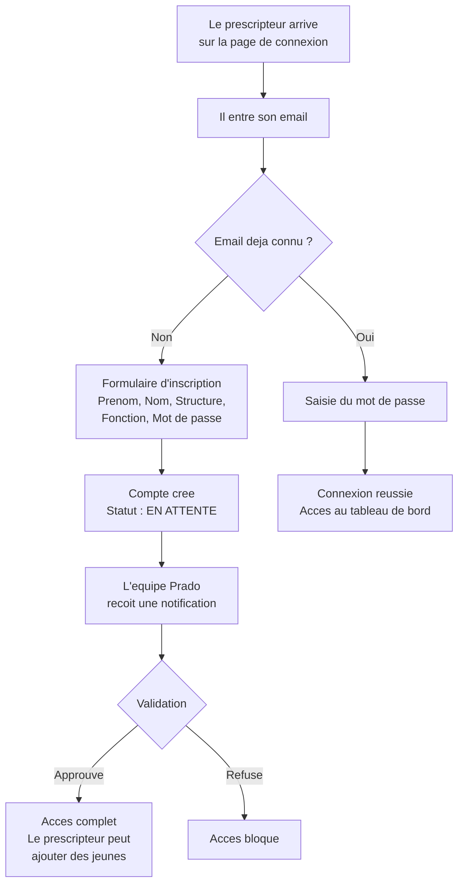
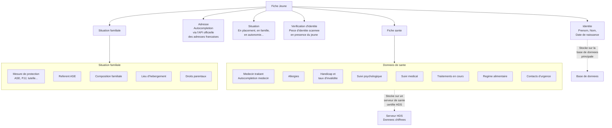
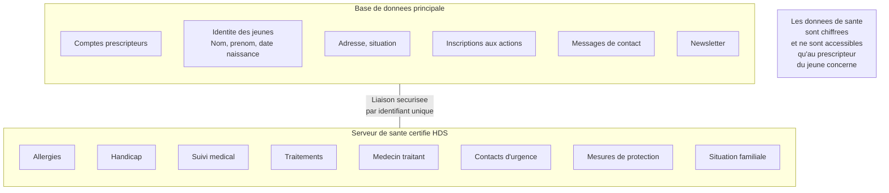
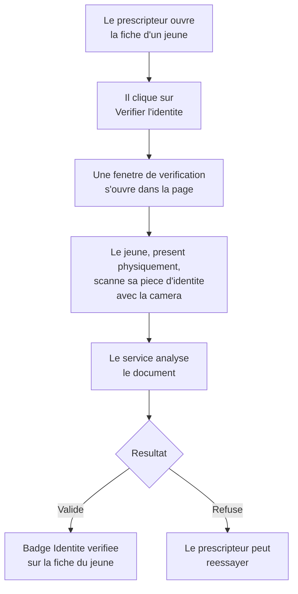
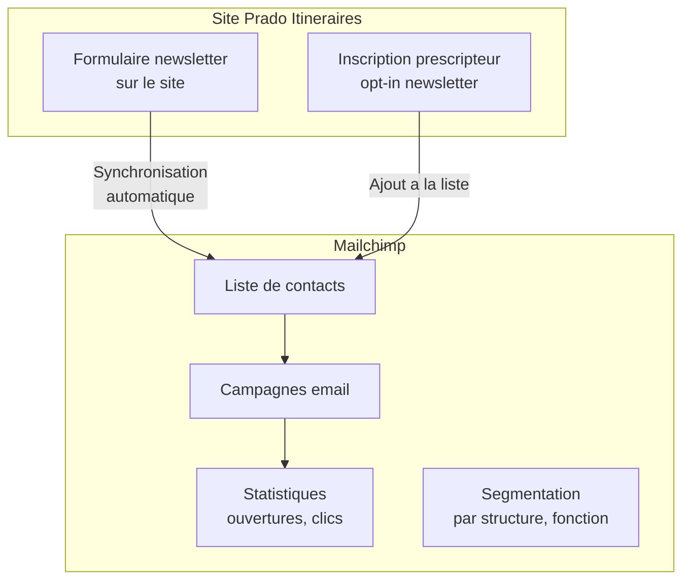

# Prado Itineraires — Presentation du projet

> Document a destination de l'equipe Prado
> Version du 27 mars 2026

---

## Sommaire

1. [Ce que fait la plateforme](#1-ce-que-fait-la-plateforme)
2. [Les trois espaces](#2-les-trois-espaces)
3. [Parcours utilisateur](#3-parcours-utilisateur)
4. [Gestion des jeunes](#4-gestion-des-jeunes)
5. [Donnees de sante et obligations legales](#5-donnees-de-sante-et-obligations-legales)
6. [Verification d'identite](#6-verification-didentite)
7. [Contenu du site (CMS)](#7-contenu-du-site-cms)
8. [Emails et newsletter](#8-emails-et-newsletter)
9. [Choix techniques et pourquoi](#9-choix-techniques-et-pourquoi)
10. [Services utilises](#10-services-utilises)
11. [Connexions a configurer](#11-connexions-a-configurer)
12. [Securite et conformite RGPD](#12-securite-et-conformite-rgpd)
13. [Foire aux questions](#13-foire-aux-questions)

---

## 1. Ce que fait la plateforme

Prado Itineraires est une plateforme web qui permet a l'association Le Prado de :

- **Presenter ses programmes** au grand public (site vitrine)
- **Permettre aux professionnels** (educateurs, referents ASE/PJJ, conseillers en insertion) de creer un compte, d'enregistrer les jeunes qu'ils accompagnent et de les inscrire a des actions
- **Gerer l'activite** depuis un panneau d'administration : valider les comptes professionnels, gerer les actions, suivre les inscriptions, consulter les messages

La plateforme fonctionne sur ordinateur, tablette et telephone.

---

## 2. Les trois espaces

```mermaid
graph TB
    subgraph PUBLIC["Site vitrine"]
        direction TB
        P1["Page d'accueil"]
        P2["Catalogue d'actions"]
        P3["Actualites"]
        P4["Ressources et documents"]
        P5["Contact"]
        P6["Newsletter"]
        P7["Pages programmes<br/>Foodtruck, Fresque, EduColab"]
    end

    subgraph ESPACE["Espace prescripteur"]
        direction TB
        E1["Tableau de bord<br/>Vue d'ensemble de l'activite"]
        E2["Mes jeunes<br/>Fiches avec identite,<br/>adresse, sante, famille"]
        E3["Actions disponibles<br/>Parcourir et inscrire"]
        E4["Mes inscriptions<br/>Suivi et annulation"]
        E5["Ressources"]
        E6["Parametres du compte"]
    end

    subgraph ADMIN["Administration"]
        direction TB
        A1["Tableau de bord<br/>Statistiques globales"]
        A2["Prescripteurs<br/>Approuver ou refuser<br/>les nouveaux comptes"]
        A3["Actions<br/>Creer, archiver,<br/>gerer les places"]
        A4["Jeunes<br/>Vue globale"]
        A5["Messages de contact"]
        A6["Newsletter<br/>Abonnes et exports"]
    end

    V["Visiteur"] --> PUBLIC
    PR["Prescripteur"] --> ESPACE
    AD["Equipe Prado"] --> ADMIN
```

### Qui voit quoi ?

| Fonctionnalite | Visiteur | Prescripteur en attente | Prescripteur valide | Admin |
|---|---|---|---|---|
| Site vitrine | Oui | Oui | Oui | Oui |
| Tableau de bord | — | Lecture seule | Complet | Admin |
| Ajouter un jeune | — | Bloque | Oui | — |
| Inscrire a une action | — | Bloque | Oui | — |
| Fiche sante | — | — | Ses jeunes uniquement | — |
| Valider un prescripteur | — | — | — | Oui |
| Gerer les actions | — | — | — | Oui |
| Voir tous les jeunes | — | — | — | Oui |

Un prescripteur ne peut jamais voir les jeunes d'un autre prescripteur. Cette isolation est geree au niveau de la base de donnees.

---

## 3. Parcours utilisateur

### Inscription d'un prescripteur

### Guide de demarrage

A la premiere connexion, un **widget de demarrage** guide le prescripteur etape par etape :

1. Creer son compte
2. Completer son profil professionnel
3. Parcourir le catalogue d'actions
4. Ajouter son premier jeune
5. Inscrire un jeune a une action

Ce guide apparait sous forme d'un petit bouton flottant en bas a droite. Il montre la progression et disparait une fois toutes les etapes completees.

---

## 4. Gestion des jeunes

### Fiche jeune — ce qui est enregistre

### Inscription a une action

Le prescripteur peut inscrire ses jeunes a des actions depuis le catalogue ou depuis la fiche du jeune. Le systeme verifie automatiquement s'il reste des places disponibles.

---

## 5. Donnees de sante et obligations legales

### Pourquoi un serveur separe pour la sante ?

La loi francaise impose que les **donnees de sante a caractere personnel** soient hebergees chez un prestataire certifie **HDS** (Hebergeur de Donnees de Sante).

> **Article L1111-8 du Code de la Sante Publique** :
> « Toute personne qui heberge des donnees de sante a caractere personnel [...] doit etre titulaire d'un certificat de conformite. »
>
> Source : [legifrance.gouv.fr](https://www.legifrance.gouv.fr/codes/article_lc/LEGIARTI000043895875)

### Ce que cela signifie concretement

**En pratique** :
- Les informations d'identite (nom, prenom) restent sur la base de donnees principale
- Les informations medicales et familiales sont stockees sur un serveur certifie HDS
- Le lien entre les deux se fait par un identifiant unique (pas le nom du jeune)
- Chaque acces aux donnees de sante est trace (qui a consulte, quand)
- Les donnees sont chiffrees au repos

### Hebergeurs envisages

| Hebergeur | Certification HDS | Localisation |
|-----------|:-:|---|
| OVH Healthcare | Oui | France |
| Scaleway | Oui | France |
| Clever Cloud | Oui | France |

La migration sera effectuee avant toute saisie de donnees de sante reelles.

---

## 6. Verification d'identite

Pour securiser l'acces et verifier l'identite des jeunes, la plateforme integre un service de verification d'identite (Veriff).

### Comment ca marche

- La verification se fait en **presence du jeune**
- Le prescripteur lance la verification depuis la fiche du jeune
- Le resultat est automatique (quelques minutes)
- Un badge "Identite verifiee" apparait sur la fiche

---

## 7. Contenu du site (CMS)

Le contenu du site vitrine est gere via **Prismic**, un systeme de gestion de contenu en ligne.

### Qu'est-ce que Prismic ?

C'est un outil en ligne (comme un WordPress simplifie) qui permet a l'equipe Prado de **modifier le contenu du site sans toucher au code** :

- Modifier les textes de la page d'accueil
- Publier des actualites (articles)
- Ajouter ou modifier des ressources (guides, fiches pratiques)
- Gerer les documents telechargeables

L'equipe Prado recevra un acces a l'interface Prismic avec une formation pour etre autonome sur la mise a jour du contenu.

### Ce qui est gere dans Prismic

| Contenu | Modifiable par Prado |
|---------|:---:|
| Page d'accueil (textes, chiffres, temoignages) | Oui |
| Actualites / Articles | Oui |
| Ressources (fiches, guides) | Oui |
| Documents telechargeables | Oui |
| Catalogue d'actions | Non (gere dans l'admin) |
| Fiches jeunes | Non (gere par les prescripteurs) |

---

## 8. Emails et newsletter

### Emails automatiques

La plateforme envoie des emails automatiques dans les cas suivants :

- **Confirmation de newsletter** : quand un visiteur s'abonne (double opt-in)
- **Notification de contact** : quand un visiteur envoie un message via le formulaire
- **Rappels d'actions** : avant une action (J-2 et J-1)
- **Lien de connexion** : magic link pour se connecter sans mot de passe

### Newsletter — Connexion Mailchimp

Pour la gestion avancee des newsletters (campagnes, segmentation, statistiques d'ouverture), la plateforme sera connectee a **Mailchimp** :

**Ce qu'il faudra configurer** :
- Creer un compte Mailchimp (gratuit jusqu'a 500 contacts)
- Connecter la cle API Mailchimp a la plateforme
- Definir les listes et segments souhaites
- L'equipe Prado gere ses campagnes directement dans Mailchimp

---

## 9. Choix techniques et pourquoi

### Pourquoi une application web sur mesure ?

Plutot qu'un site WordPress avec des plugins, nous avons choisi une application web sur mesure pour plusieurs raisons :

| Critere | WordPress + plugins | Application sur mesure |
|---------|:---:|:---:|
| Gestion des comptes prescripteurs | Complexe, plugins fragiles | Natif, securise |
| Donnees de sante | Impossible de garantir la conformite HDS | Architecture dediee |
| Verification d'identite | Pas de solution | Integration Veriff |
| Performance | Lent avec beaucoup de plugins | Rapide, optimise |
| Securite | Vulnerable (plugins tiers) | Controle total |
| Evolution | Limitee par les plugins | Illimitee |
| Cout de maintenance | Mises a jour constantes | Stable |

### L'application en bref

| Composant | Ce que c'est | Pourquoi ce choix |
|-----------|-------------|-------------------|
| **Application web** | Une application moderne qui fonctionne dans le navigateur | Rapide, reactive, fonctionne sur tous les appareils |
| **Base de donnees** | Stocke toutes les informations (comptes, jeunes, inscriptions) | Securisee, isolee par utilisateur, hebergee en Europe |
| **CMS** (Prismic) | Systeme de gestion du contenu editorial | L'equipe Prado peut modifier les textes et articles sans nous |
| **Serveur de sante** (HDS) | Base de donnees separee pour les donnees medicales | Obligation legale, donnees chiffrees |
| **Hebergement** (Vercel) | Ou tourne l'application | Deploiement automatique, rapide, fiable |

---

## 10. Services utilises

| Service | Role | Cout |
|---------|------|------|
| **Base de donnees** | Stockage des comptes, jeunes, inscriptions | Inclus (plan gratuit suffisant) |
| **Prismic** | Gestion du contenu editorial (articles, ressources) | Gratuit (plan starter) |
| **Veriff** | Verification d'identite des jeunes | ~1 EUR par verification |
| **Mailchimp** | Newsletters et campagnes email | Gratuit jusqu'a 500 contacts |
| **Resend** | Emails transactionnels (confirmations, rappels) | Gratuit jusqu'a 3000 emails/mois |
| **API Adresse** | Autocompletion des adresses francaises | Gratuit (service gouvernemental) |
| **Hebergement** | Mise en ligne de l'application | Inclus (plan gratuit) |
| **Serveur HDS** | Donnees de sante | ~30-50 EUR/mois |

---

## 11. Connexions a configurer

Avant la mise en production, ces services devront etre configures par l'equipe technique :

| Service | Action requise | Par qui |
|---------|---------------|---------|
| **Nom de domaine** | Acheter et configurer prado-itineraires.fr | Allside |
| **Mailchimp** | Creer le compte, fournir la cle API | Prado + Allside |
| **Veriff** | Verifier l'identite du titulaire du compte (une fois) | Prado |
| **Prismic** | Formation de l'equipe a l'interface | Allside |
| **Serveur HDS** | Choisir l'hebergeur, deployer la base | Allside |
| **Email d'envoi** | Configurer le domaine d'envoi (itineraires@le-prado.fr) | Prado (DNS) + Allside |

---

## 12. Securite et conformite RGPD

### Mesures de securite

- **Isolation des donnees** : chaque prescripteur ne voit que ses propres jeunes
- **Validation manuelle** : tout nouveau compte est verifie par l'equipe Prado avant activation
- **Chiffrement** : les donnees de sante sont chiffrees dans la base
- **Connexion securisee** : HTTPS sur tout le site, mots de passe haches
- **Verification d'identite** : possibilite de verifier l'identite des jeunes avec une piece d'identite

### Conformite RGPD

- **Bandeau cookies** : le visiteur choisit d'accepter ou refuser
- **Politique de confidentialite** : accessible sur le site
- **Droit a la suppression** : un prescripteur peut supprimer son compte et toutes ses donnees
- **Export des donnees** : un prescripteur peut exporter ses donnees personnelles
- **Newsletter** : inscription avec double confirmation (double opt-in)
- **Donnees de mineurs** : conformite renforcee (pas de collecte directe aupres des jeunes, tout passe par le prescripteur)

---

## 13. Foire aux questions

### Pourquoi ne pas tout mettre sur le meme serveur ?

La loi francaise (Article L1111-8 du Code de la Sante Publique) impose que les donnees de sante soient hebergees chez un prestataire certifie HDS. Notre base de donnees principale n'a pas cette certification. Nous separons donc les donnees : l'identite et les inscriptions d'un cote, les informations medicales de l'autre, sur un serveur certifie.

### Pourquoi ne pas utiliser WordPress ?

WordPress est excellent pour les sites vitrines simples, mais Prado Itineraires a des besoins specifiques : gestion de comptes professionnels avec validation, donnees de sante chiffrees, verification d'identite, inscription a des actions avec gestion de capacite. Ces fonctionnalites necessitent une application sur mesure pour garantir la securite et la fiabilite.

### Est-ce que l'equipe Prado peut modifier le contenu du site ?

Oui, grace a Prismic (le CMS). L'equipe peut modifier les textes de la page d'accueil, publier des actualites, ajouter des ressources et des documents, le tout depuis une interface simple accessible dans le navigateur.

### Est-ce que l'application fonctionne sur telephone ?

Oui, l'application est responsive : elle s'adapte automatiquement a la taille de l'ecran (ordinateur, tablette, telephone).

### Que se passe-t-il si un prescripteur quitte son poste ?

L'equipe Prado peut desactiver son compte depuis le panneau d'administration. Les fiches jeunes associees restent dans le systeme et peuvent etre reassignees si necessaire.

### Combien coute l'hebergement ?

L'hebergement de l'application et de la base de donnees principale est gratuit (plans gratuits suffisants pour le volume prevu). Le seul cout recurrent est le serveur HDS pour les donnees de sante (~30-50 EUR/mois) et les verifications d'identite (~1 EUR/verification).

### Comment sont proteges les donnees des jeunes ?

Chaque prescripteur ne voit que ses propres jeunes. Cette isolation est geree au niveau de la base de donnees (pas juste dans l'interface). Meme en cas de faille dans l'application, un prescripteur ne pourrait pas acceder aux donnees d'un autre. Les donnees de sante sont en plus chiffrees et stockees sur un serveur certifie.

### Qui peut acceder au panneau d'administration ?

Uniquement les comptes ayant le role "admin", attribue par l'equipe technique. Ce role ne peut pas etre auto-attribue par un prescripteur.
